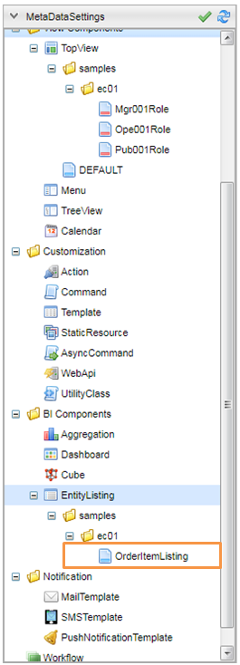
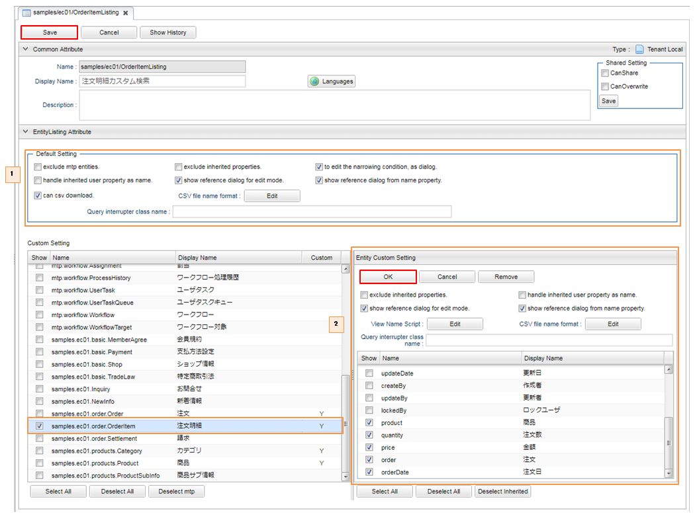
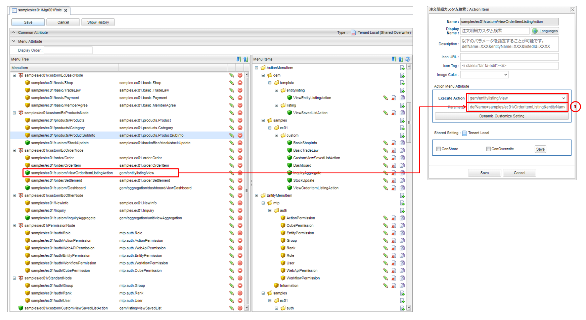
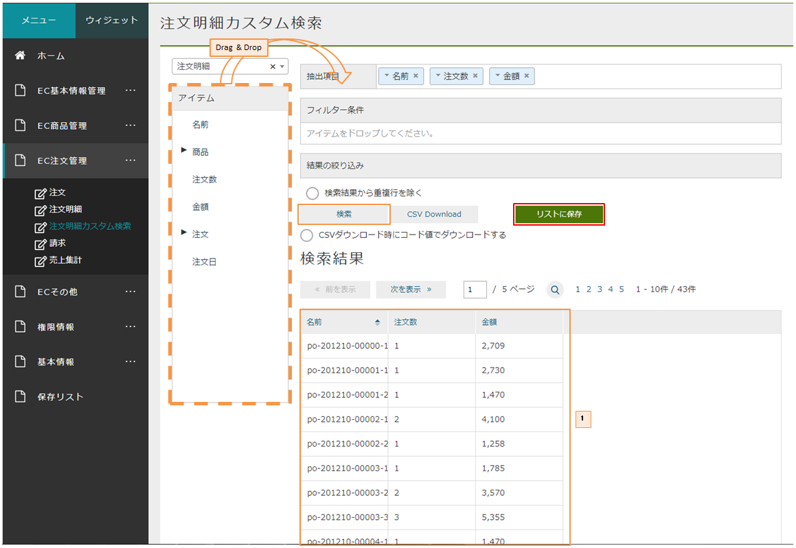

[[EEPackage_EntityListing]]
== [.eeonly]#Entity Listing#

このサンプルではマネージャーに属するユーザーが注文明細のエンティティデータに対して、以下の操作が可能です。

. 抽出条件を指定すること
. その作成した条件や検索結果を保存・共有

※　Entity Listingの作成方法は開発者ガイド<<../../developerguide/entitylisting/index#, EntityListing>>の章を参照してください。

=== AdminConsoleでの設定

. 注文明細カスタム検索EntityListing

. Default Setting　設定を変更すると、「Save」ボタンをクリックして変更を保存します。
. Custom Setting　設定を変更すると、「OK」ボタンをクリックして変更を保存します。 ※

※　Custom Settingでの設定がDefault Settingより優先されます。設定項目の説明は開発者ガイド<<../../developerguide/entitylisting/index#entitylisting_management, EntityListingの管理>>の章を参照してください。

メニューへの登録

マネージャー用メニュー定義を開きます。

. アクションパラメーターをdefName=samples/ec01/OrderItemListing&entityName=samples.ec01.order.OrderItemに指定します。 ※

※　作成されたEntityListingをメニューに登録する方法について、開発者ガイド<<../../developerguide/entitylisting/index#_表示方法, 表示方法>>を参照してください。

=== 画面表示

マネージャーに属するユーザーが「EC注文管理」メニューを開き、「注文明細カスタム検索」サブメニューを開くと、注文明細カスタム検索を操作することが出来ます。

. 「リスト保存」をクリックすると、検索結果を保存リストに保存することができます。