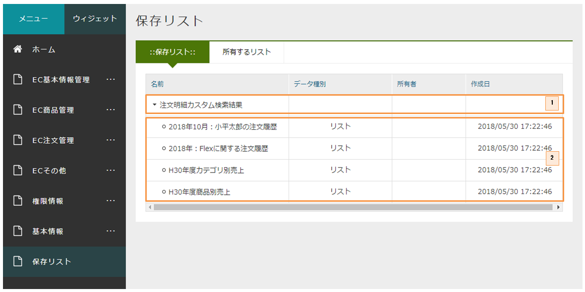
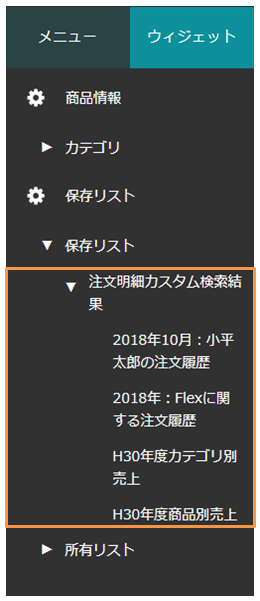
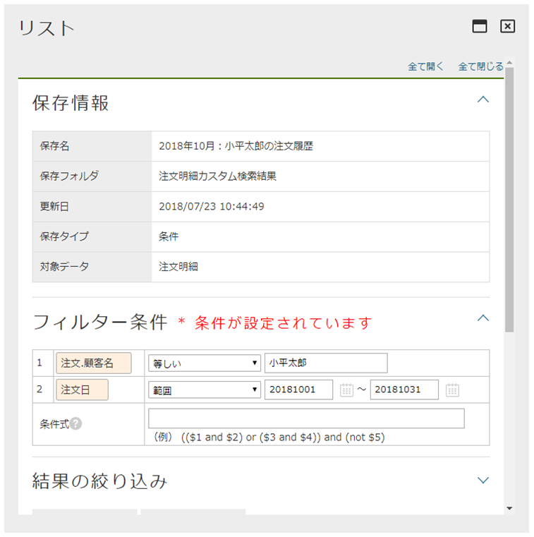
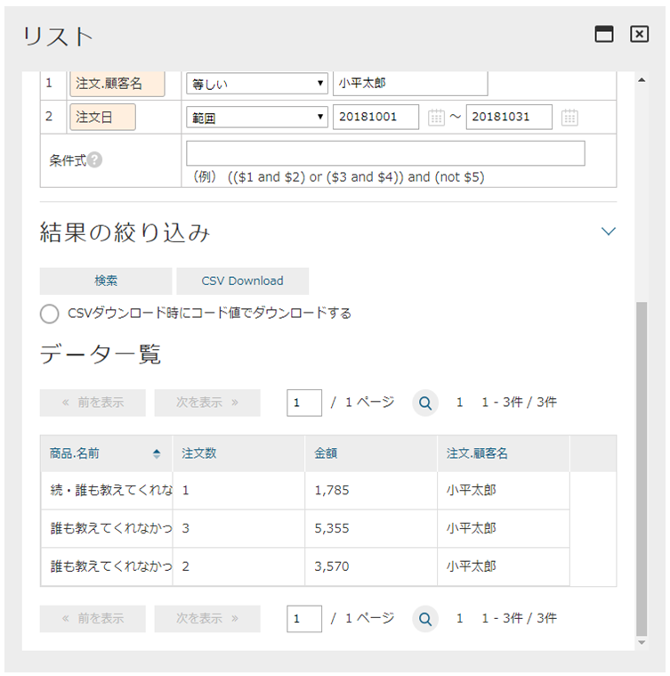

[[EEPackage_SavedList]]
== [.eeonly]#保存リスト#

サンプルアプリでは、いくつかの注文明細カスタム検索の検索結果を保存リストとして保存しています。 +
マネージャーに属するユーザーで「保存リスト」メニューを開くと、保存フォルダと保存リスト一覧を参照することができます。

. 保存フォルダ
. 保存リスト

また、管理画面のメニューのウィジェットエリアからも参照することができます。

例えば、「2018年10月：小平太郎の注文履歴」という保存リストをクリックすると、以下の保存情報が表示されます。

※ 検索結果の保存と表示方法については、開発者ガイドの<<../../developerguide/entitylisting/index#,EntityListing>>の章を参照してください。