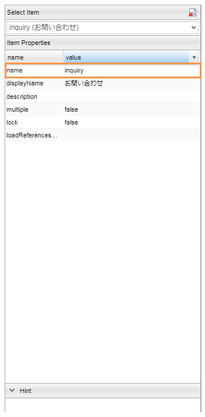

[[EEPackage_Workflow]]
== [.eeonly]#Workflow#

このサンプルでは、「お問合せ処理」と「注文処理」ワークフローが用意されています。

. お問合せ処理ワークフロー
. 注文処理ワークフロー

NOTE: 実際にワークフローを実行する場合は、「オペレーター」グループと「マネージャー」グループそれぞれに属する
ユーザーの登録が必要です。 +
ユーザー登録の詳細については、<<../index#GlobalSettings_About_User, ユーザーについて>>を参照してください。

[[EEPackage_Inquriy_Processing_Workflow]]
=== お問合せ処理

==== ワークフローの作成

. エンティティが格納されている変数名を指定します。
+

. お問合せ対応処理 + 
+
オペレーターに属するユーザーにタスクを割り当てるように設定しています。
+

. 対応完了ユーザータスク +
+
当該お問合せエンティティのお問合せステータスを対応完了（「３」）に設定します。
+

. お問合せ終了承認 +
マネージャーに属するユーザーにタスクを割り当てるように設定しています。 + 
当該タスクに対して「承認」または「差し戻し」を選択することができます。実行結果によって、ワークフローの遷移先が変わります。
+

. 対応完了ユーザータスク +
+
当該お問合せエンティティのお問合せステータスを処理中（「２」）に戻します。

. 対応完了ユーザータスク +
+
当該お問合せエンティティのお問合せステータスを終了（「４」）に設定します。

※　ワークフローの設定項目について、開発者ガイド<<../../developerguide/workflow/index#, Workflow>>の章を参照してください。

==== ワークフローの起動

お問合せエンティティに「afterInsert」イベントリスナーを登録しています。

[source,Groovy]
----
import java.util.LinkedHashMap;
import java.util.Map;
import org.iplass.mtp.ManagerLocator;
import org.iplass.mtp.workflow.WorkflowManager;

def wm = ManagerLocator.manager(WorkflowManager.class);

Map<String, Object> parameters = new LinkedHashMap<String, Object>();
parameters.put("inquiry", entity); <1>

wm.startProcess("samples/ec01/inquiry_processing", parameters); <2>
----
<1> 登録されたお問合せエンティティを"inquiry"という変数名として格納します。
<2> お問合せ処理ワークフローを起動します。

[[EEPackage_Inquiry_Processing_Operation]]
==== 画面表示

* 事前設定
+
このサンプルではワークフローの詳細表示の項目は事前に設定されています。ワークフローの詳細表示を調整したい時は、対象ロールのメニュー（このサンプルでは、オペレーター用のメニューは "Ope001Role"）に「UserTask List」の編集画面を開き、 + 
[.red]#「UserTaskView Settings」タブのワークフロー履歴項目に表示したい項目にチェックをいれてください。マネージャー用のメニューに同じような操作を実施してください。# + 
+
※ 設定項目の説明は開発者ガイド<<../../developerguide/workflow/index#_利用方法, 利用方法>>の章を参照してください。
+

* サンプルアプリの画面でお問合せ登録します。
+

* オペレーターに属するユーザーのアカウントを利用して管理用画面にログインすると、ユーザータスク一覧に割り当てられたタスクを確認することが出来ます。 +
鉛筆マークの編集ボタンをクリックすると、編集画面が開きます。
+

+
コメントを入れて、「完了」ボタンを押します。 + 
ワークフロー履歴一覧に対応処理完了の操作履歴が確認できます。
+

* マネージャーに属するユーザーのアカウントを利用して管理用画面にログインすると、ユーザータスク一覧に割り当てられたタスクを確認することが出来ます。 +
鉛筆マークの編集ボタンをクリックすると、編集画面が開きます。
+

+
コメントを入れて、「承認」または「差し戻し」処理が実行できます。今回は「承認」処理を実行します。 + 
ワークフロー履歴一覧に対応終了承認の操作履歴が確認できます。
+

[[EEPackage_Order_Processing_Workflow]]
=== 注文処理ワークフロー

==== ワークフローの作成

. settlementの変数名を指定します。
. mailの変数名を指定します。
+

. 注文完了メールタスク + 
+
Scriptの方式でmail変数名に格納されている文字列をTOメールアドレスに設定します。
+
※　設定方法は開発者ガイド<<../../developerguide/workflow/index#_mailtask,MailTask>>の章を参照してください。
+

. 配送処理を定義します + 
割当ルールの種類をToQueueに設定します。 ※ +
エンティティが"settlement"という変数に格納されているので、taskTargetEntityを"settlement" に指定します。 + 
当該タスクに対して「配送完了」または「配送不可」を選択することができます。実行結果によって、ワークフローの遷移先が変わります。
+
※　割当ルールの設定項目の説明は開発者ガイド <<../../developerguide/workflow/index#ref_usertask_assign_rule, 割当ルールの設定>>の章を参照してください。
+

. ステータス更新 +
請求エンティティの請求状況更新用のコマンドクラスを呼び出します。
+

+
[source,Groovy]
----
import org.iplass.mtp.entity.UpdateOption;
import org.iplass.mtp.entity.SelectValue;
import org.iplass.mtp.util.DateUtil;

def settlement = request.getAttribute("settlement"); 
def status = settlement.settlementStatus.value;
def oid = settlement.oid.value;

// 請求状況
settlement.setValue("settlementStatus", new SelectValue("2")); <1>

// 納品予定日
settlement.setValue("deliverGoodsDate", DateUtil.getCurrentTimestamp()); <2>

UpdateOption option = new UpdateOption(false);
option.setUpdateProperties("settlementStatus", "deliverGoodsDate");
em.update(settlement, option);
----
<1> 請求エンティティの請求状況を納品済み（「２」）に設定します。
<2> 請求エンティティの納品予定日を今日の日付に設定します。

. ステータス更新処理（キャンセル）
請求エンティティの請求状況をキャンセル（「３」）に設定します。

. 配送完了メールタスク + 
配送完了メールを送信します。

==== ワークフローの起動

請求エンティティに「afterInsert」イベントリスナーを登録しています。

[source,Groovy]
----
import java.util.LinkedHashMap;
import java.util.Map;
import org.iplass.mtp.ManagerLocator;
import org.iplass.mtp.workflow.WorkflowManager;

def wm = ManagerLocator.manager(WorkflowManager.class);

Map<String, Object> parameters = new LinkedHashMap<String, Object>();
parameters.put("settlement", entity); <1>
parameters.put("mail", entity.order.mail); <2>
wm.startProcess("samples/ec01/order_processing", parameters); <3>
----
<1> 登録された請求エンティティを"settlement"という変数名に格納します。
<2> 登録された請求エンティティに紐づくオーダーエンティティの顧客メールアドレスを"mail"という変数名に格納します。
<3> 注文処理ワークフローを起動します。

==== 画面表示

* 事前設定

** このサンプルではワークフロー履歴が見えるように、まずお問合せ処理ワークフローでの画面表示の<<index#EEPackage_Inquiry_Processing_Operation,事前設定>>を実施してください。

** それに、ログ出力に送信メールを確認できるようにsrc/main/resouces/mtp-service-config.xmlファイルに以下の定義を追加してください。
+
[source,xml]
----
	<service>
		<interface>org.iplass.mtp.impl.mail.MailService</interface>
				<!-- ■ for develop only (additional="true) ■ -->
		<!-- 送信メールをデバッグ出力する場合、以下を有効にしてください。 -->

		<property name="listener" class="org.iplass.mtp.mail.listeners.LoggingSendMailListener" additional="true"/>

	</service>
----

* サンプルアプリの画面でオーダーを注文します。
+

* 注文完了メールタスクの実行確認
+
[source]
----

16:47:42.438 [http-nio-8080-exec-8] DEBUG 41 Anonymous samples/ec01/shipping/OrderCommand  o.i.m.i.transaction.LocalTransaction - commit Transaction:org.iplass.mtp.impl.transaction.LocalTransaction@841561c
16:47:42.453 [http-nio-8080-exec-8] DEBUG 41 Anonymous samples/ec01/shipping/OrderCommand  o.i.m.i.r.c.LocalTransactionConnectionWrapper - back to ResourceHolder:1503931896, URL=jdbc:mysql://[host]:[port]/[schema]
16:47:42.453 [http-nio-8080-exec-8] DEBUG 41 Anonymous samples/ec01/shipping/OrderCommand  o.i.m.i.transaction.LocalTransaction - close Transaction:org.iplass.mtp.impl.transaction.LocalTransaction@841561c
16:47:42.548 [http-nio-8080-exec-8] DEBUG 41 Anonymous samples/ec01/shipping/OrderCommand  o.i.m.m.l.LoggingSendMailListener -   From:testFrom@test.jp ReplyTo:testFrom@test.jp To:(1)sakaki@test.co.jp; Cc:(0) Bcc:(0) Subject:testHou06 ご注文の確認 FileName: PlainMessage:榊太郎さん、ご注文いただきありがとうございます。  【ご注文内容】 注文番号：po-201806-00041 Ｅメールアドレス：sakaki@test.co.jp ご住所：東京都千代田区x－x－x　xxx室  注文合計： ￥   testHou06 に商品をご注文いただいた場合、本メールは、当サイトがご注文を受領したことを確認するものにすぎません。 testHou06 が販売する商品については、商品が発送されたことをお知らせするメールを当サイトからお送りした時点で、当該商品のご購入についての契約が成立します。 testHou06 以外の売主が出品する商品については、商品が発送されたことをお知らせするメールを当サイトからお送りする時点で、当該商品のご購入についての契約が成立します。  このEメールアドレスは、配信専用です。このメッセージに返信しないようお願いいたします。  今後ともtestHou06 をよろしくお願いいたします。  HtmlMessage:  <1>
16:47:42.548 [http-nio-8080-exec-8] DEBUG 41 Anonymous samples/ec01/shipping/OrderCommand  o.i.mtp.impl.mail.MailServiceImpl - send mail flag of tenat configration is off, so don't send mail.
----
<1> ログから送信されたメールの中身を確認することができます。

* タスクの割当
+
オペレーターまたはマネージャーに属するユーザーのアカウントを利用して管理用画面にログインすると、(タスクの割当ルールが `ToQueue` に設定されているので)「タスクリスト」画面の「全てのタスク」タブに配送処理タスクが登録されていることが確認できます。
+
割当ボタンをクリックすると、自分にこのタスクを割り当てます。
+

* 配送処理
+
Myタスクのタスクに鉛筆マークの編集ボタンをクリックすると、編集画面が開きます。 +
コメントを入力して、「配送完了」または「配送不可」処理が実行できます。今回は「配送完了」処理を実行します。 +
配送完了ボタンを押しましたら、ワークフロー履歴一覧に配送完了の操作履歴が確認できます。
+

* 配送完了メールタスクの実行確認
+
[source]
----
17:02:13.567 [http-nio-8080-exec-9] DEBUG 41 76158 CompositeCommand  o.i.m.i.transaction.LocalTransaction - commit Transaction:org.iplass.mtp.impl.transaction.LocalTransaction@20414901
17:02:13.577 [http-nio-8080-exec-9] DEBUG 41 76158 CompositeCommand  o.i.m.i.r.c.LocalTransactionConnectionWrapper - back to ResourceHolder:1402918786, URL=jdbc:mysql://[host]:[port]/[schema]
17:02:13.577 [http-nio-8080-exec-9] DEBUG 41 76158 CompositeCommand  o.i.m.i.transaction.LocalTransaction - close Transaction:org.iplass.mtp.impl.transaction.LocalTransaction@20414901
17:02:13.680 [http-nio-8080-exec-9] DEBUG 41 76158 CompositeCommand  o.i.m.m.l.LoggingSendMailListener -   From:testFrom@test.jp ReplyTo:testFrom@test.jp To:(1)sakaki@test.co.jp; Cc:(0) Bcc:(0) Subject:testHou06 ご注文の発送 (po-201806-00041) FileName: PlainMessage:testHou06 をご利用いただき、ありがとうございます。  お客様からご注文いただいた商品を本日発送いたしました。  【ご注文内容】 注文番号：po-201806-00041 Ｅメールアドレス：sakaki@test.co.jp ご住所：  注文合計： ￥   testHou06 のまたのご利用をお待ちしております。 このEメールアドレスは配信専用です。このメッセージに返信しないようお願いいたします。 HtmlMessage:  <1>
17:02:13.680 [http-nio-8080-exec-9] DEBUG 41 76158 CompositeCommand  o.i.mtp.impl.mail.MailServiceImpl - send mail flag of tenat configration is off, so don't send mail.
----
<1> ログから送信されたメールの中身を確認することができます。
