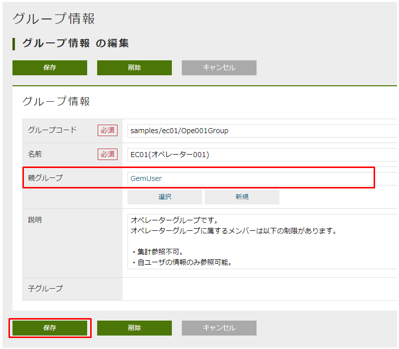

[[GlobalSettings]]
== サンプルアプリのグローバル設定

[[GlobalSettings_About_User]]
=== ユーザーについて
* サンプルは3つのグループ（≒ロール）によって機能を分けています。

.. マネージャー （「EC01(マネージャー001)」グループ） +
[NOTE]
このグループで管理画面が参照できるように親グループを `GemUser` に指定する必要があります。

.. オペレーター （「EC01(オペレーター001)」グループ） +
[NOTE]
このグループで管理画面が参照できるように親グループを `GemUser` に指定する必要があります。

.. 利用ユーザー （「 EC01(利用ユーザー001)」グループ） +
[NOTE]
利用ユーザーは管理画面を参照することができないので、親グループを `GemUser` に指定する必要はありません。

* 各グループによって実行可能な権限などをあらかじめ登録してあります。実際に各グループの権限によってどのように挙動が変わるのかを確認したい場合は、それぞれのグループに属するユーザーを登録してください（サンプルアプリ用のメタデータとEntityデータををインポートしたタイミングでは、ユーザー情報は登録されません）。

* iPLAssセットアップで入力したテナント管理者ユーザーで管理画面にログインし、マネージャーとオペレーターグループの親グループを `GemUser` に変更します。変更を反映するために、一度ログアウトして再ログインしてください。 +
+
鉛筆マークの「編集」アイコンをクリックします。
+

+
該当グループの親グループを `GemUser` に指定し、「保存」ボタンをクリックします。
+

+
「EC01(マネージャー001)」グループと「EC01(オペレーター001)」グループの親グループが `GemUser` になっていることを確認します。
+

* ローカルの開発環境での実行時にユーザーを新規登録したい場合、仮パスワードの送信メールがログに出力できるように `src/main/resouces/mtp-service-config.xml` に以下の設定を追加してください。
+
[source,xml]
----
	<service>
		<interface>org.iplass.mtp.impl.mail.MailService</interface>
		<!-- ■ for develop only (additional="true) ■ -->
		<!-- 送信メールをデバッグ出力する場合、以下を有効にしてください。 -->

		<property name="listener" class="org.iplass.mtp.mail.listeners.LoggingSendMailListener" additional="true"/>

	</service>
----
+
実行例
+
[source]
----
15:56:17.038 [http-nio-8080-exec-9] DEBUG 26 907 gem/generic/detail/InsertCommand  o.i.m.m.l.LoggingSendMailListener -   From:test@contract.dentsusoken.com ReplyTo:test@contract.dentsusoken.com To:(1)NewUser001@test.co.jp; Cc:(0) Bcc:(0) Subject:【testTenant】ユーザー登録のお知らせ FileName: PlainMessage:新規ユーザー001様  testTenantに「新規ユーザー001」様のユーザー登録が行われました。  ユーザーIDと仮パスワードが発行されましたので、下記URLからtestTenantにアクセスし、 パスワードの登録作業を実施して下さい。     URL: XXXXXXXX    ユーザーID: NewUser001    ユーザー名: 新規ユーザー001    仮パスワード: i7~n.5,!  ===================================================================== □ 本メールにお心当たりが無い方へ  本メールは、testTenantにてユーザー登録を頂いたお客様にお送りしています。 このメールにお心当たりのない場合は、お手数ですが下記、アドレス (送信元アドレス)までご連絡下さい。    testTenant事務局     =====================================================================  送信元：株式会社 電通総研 COPYRIGHT 2011 DENTSU SOKEN INC. ALL RIGHTS RESERVED. HtmlMessage: 
15:56:17.038 [http-nio-8080-exec-9] DEBUG 26 907 gem/generic/detail/InsertCommand  o.i.mtp.impl.mail.MailServiceImpl - send mail flag of tenat configration is off, so don't send mail.
----

=== 多言語対応について
* 多言語対応を有効化するためには以下の操作を行う必要があります。 +
※カレンダー、集計にて一部多言語対応されていない部分があります。

** Admin Consoleのテナント情報の設定で、多言語利用を「利用する」、利用可能言語で「日本語」と「English」を選択して保存します。 +
※ Java／JSP版とVue.js／WebAPI版の場合、多言語利用に設定が必要です。 +
※ Groovy／GroovyTemplate版の場合、テナント情報のメタデータがPackaging機能を利用してインポートされるため、多言語利用に設定は不要です。
+

** 多言語の利用 +
下図のように言語選択がメニューに表示されます。言語を選択後、新たに遷移した画面から選択言語が有効になります。
+

* 管理者向けのTop画面（英語版）
+

* 一般消費者向けのTop画面（英語版）
+

[[GlobalSettings_FullTextSearch_Settings]]
=== 全文検索について

* 管理画面で利用可能です。詳細な利用方法は開発者ガイドの<<../developerguide/datamanagement/index#ref_fulltext_search, 全文検索>>の章を参照ください。
+								

+
プルダウンでエンティティを選択すると選択したエンティティを対象に、選択しない場合はクロール対象となっている全エンティティを対象に、全文検索を実施します。
+

* 一般消費者向け画面で全文検索を利用したい場合、 `Containsクラス` を利用している箇所のソースコードのコメントを外し、関連するJavaパッケージをインポートしてください。
+
[cols="1,2"]
|===
h|ファイル名|/src/main/java/samples/ec01/command/search/FulltextSearchCommand.java
|===
+
[source,java]
----
public class FulltextSearchCommand implements Command {
    ......
	public String execute(RequestContext request) {
		String productName = request.getParam(PARAM_PRODUCT_NAME);
		String categoryOid = request.getParam(PARAM_CATEGORY_OID);

		List<Product> productList = null;
		Condition cond = null;
		String[] properties = new String[] { Product.OID, Product.NAME, Product.PRODUCT_IMG, Product.PRICE };
		if (ALL.equals(categoryOid) == false) {
			// ※ Containsを使いたい場合は、全文検索機能を設定し、有効化する必要があります。
			// cond = new And(new Contains(productName),
			// 				  new Equals(PRODUCT_CATEGORY_OID, categoryOid)); <1>
			cond = new And(new Like(Product.NAME, productName, MatchPattern.PARTIAL),
						   new Equals(PRODUCT_CATEGORY_OID, categoryOid)); <2>
		} else {
			// ※ Containsを使いたい場合は、全文検索機能を設定し、有効化する必要があります。
			// cond = new Contains(productName); <1>
			cond = new Like(Product.NAME, productName, MatchPattern.PARTIAL); <2>
		}
		productList = EntityDaoHelper.searchDistinctEntity(Product.DEFINITION_NAME, cond, properties);
		if (productList.size() > 0) {
			// 実行結果をdefaultResultとしてセットする
			request.setAttribute(RESULT_DEFAULT_RESULT, productList);
		}

		return Constants.CMD_EXEC_SUCCESS;
	}
    ......
}
----
<1> コメントを外します。
<2> コメントアウトします。