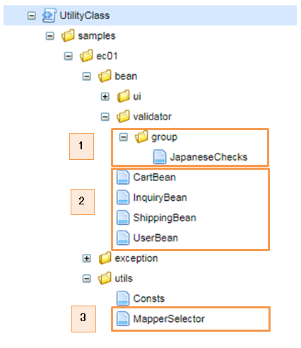
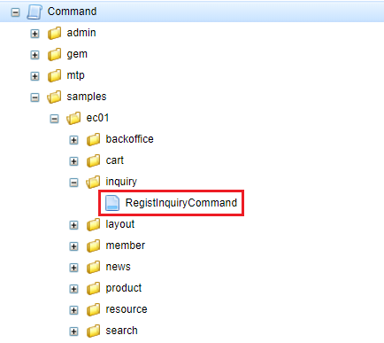
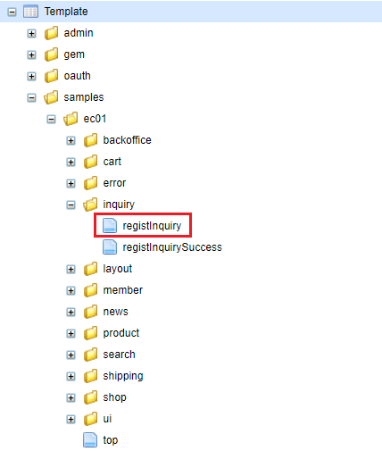
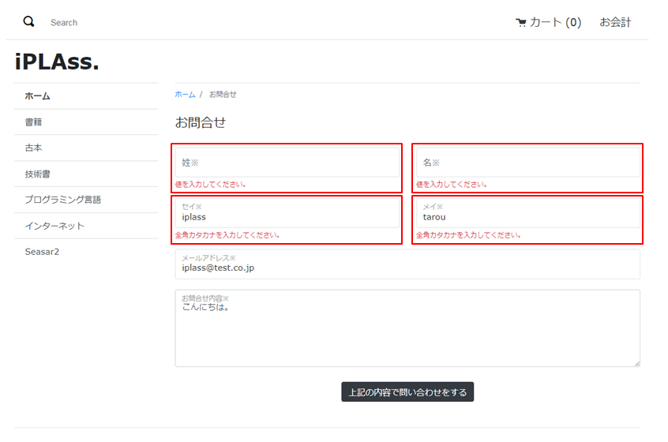
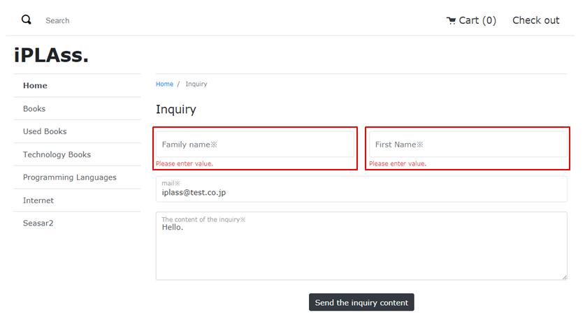

[[Groovy_GTmpl_BeanValidation]]
=== Bean／Bean Validation
iPLAssのBean/Bean Validation機能を利用する場合、バリデーションチェックしたいBeanクラスのプロパティにアノテーションをつけることで、バリデーションが自動で実行されます。また、バリデーション結果を画面に表示できます。

サンプルアプリの問い合わせ登録画面で入力された値に対してバリデーションが実行される機能を例として説明していきます。 

* 必要なUtilityClassを作成します。 + 
Admin ConsoleのUtilityClassの設定を開きます。
+

+
. カスタムのバリデーショングループ。
. JavaBeanクラス。※ このサンプルではJavaライブラリに既存のバリデーションとカスタムのバリデーショングループを利用しています。
. `org.iplass.mtp.command.beanmapper.BeanParamMapper` のラッパークラスです。
+
[cols="1,2"]
|===
h|UtilityClass名|samples.ec01.utils.MapperSelector
|===
+
[source,Groovy]
----
package samples.ec01.utils;

import org.iplass.mtp.command.beanmapper.BeanParamMapper;

public abstract class MapperSelector {
    // CartBean Mapper
   	private static final BeanParamMapper cartMapper = new BeanParamMapper().withValidation().enableAutoGrow()
			.whitelistPropertyNameRegex("cartItems\\[\\d*\\]\\.productId|cartItems\\[\\d*\\].value"); <1>
	// InquiryBean Mapper
	private static final BeanParamMapper inquiryMapper = new BeanParamMapper().withValidation()
			.whitelistPropertyNameRegex("^(mail|content|familyName(Kana)?|firstName(Kana)?)\$");
	// UserBean Mapper
	private static final BeanParamMapper userMapper = new BeanParamMapper().withValidation()
			.whitelistPropertyNameRegex("^(userId|mail|familyName(Kana)?|firstName(Kana)?)\$");
	// ShippingInfo Mapper
	private static final BeanParamMapper shippingInfoMapper = new BeanParamMapper().withValidation()
			.whitelistPropertyNameRegex("^(userId|mail|address|tel|familyName(Kana)?|firstName(Kana)?)\$");

	public static select(String name) {
        if (name == "cartBean") {
            return cartMapper;
        } else if (name == "inquiryBean") {
            return inquiryMapper;
        } else if (name == "userBean"){
            return userMapper;
        } else if (name == "shippingBean"){
            return shippingInfoMapper;
        } else {
            return null;
        }
	}
}
----
<1> BeanParamMapperの初期化処理。 + 
※ whitelistPropertyNameRegexメソッドにセット可能な項目の正規表現式を指定します。

* バリデーションエラーメッセージを定義する + 
<<index#Groovy_Gtmpl_Resource_BeanValidation,Bean Validationエラーメッセージ>>はメッセージマネージャに定義し、多言語利用が可能です。

* コマンドクラスでBean Validationを利用する
+

+
[cols="1,2"]
|===
h|Command名|samples/ec01/inquiry/RegistInquiryCommand
|===
+
[source,groovy]
----
import jakarta.validation.groups.Default;
import org.iplass.mtp.command.beanmapper.BeanParamMapper;
import org.iplass.mtp.entity.SelectValue;
import org.iplass.mtp.web.template.TemplateUtil;
import samples.ec01.bean.InquiryBean;
import samples.ec01.bean.validator.group.JapaneseChecks;
import samples.ec01.utils.MapperSelector;

// 入力チェック
def inquiryBean = new InquiryBean();
request.inquiryBean = inquiryBean;
// 日本語専用"name_kana"取得フォーム
if (TemplateUtil.getLanguage() == null || TemplateUtil.getLanguage() == "ja") {
	MapperSelector.select("inquiryBean").populate(inquiryBean, 
	    request.getParamMap(), Default.class, JapaneseChecks.class); <1>
} else {
	MapperSelector.select("inquiryBean").populate(inquiryBean, 
	    request.getParamMap(), Default.class); <2>
}

def inquiry = inquiryBean.toEntity();
// 問い合わせステータス
// 1 : 未対応
// 2 : 対応中
// 3 : 対応完了
// 4 : 終了
SelectValue inquiryStatus = new SelectValue("1");
inquiry.inquiryStatus = inquiryStatus;
// 請求の登録
em.insert(inquiry);

"SUCCESS";
----
<1> 多言語利用で「日本語」が選択されているまたは多言語利用の設定が取得できなかった場合、`samples.ec01.bean.validator.group.JapaneseChecks` グループとデフォルトグループに属する項目に対してバリデーションが実行されます。 + 
※ populate(Object, Map, Class)メソッドはスレッドセーフですが、それ以外の delimiters(char, char, char)等の設定用メソッドがスレッドセーフではありません。 詳しい説明は `org.iplass.mtp.command.beanmapper.BeanParamMapper` のJavaDocを参照してください。
<2> 多言語利用で「日本語」以外が選択されている場合、デフォルトグループに属する項目のみに対してバリデーションが実行されます。

* GroovyTemplateファイル
+

+
[cols="1,2"]
|===
h|Template名|samples/ec01/inquiry/registInquiry
|===
+
[source,Groovy]
----
        	<% bind("bean" : inquiryBean) { %> <1>
        	

                ......
                

                    

                        <% bind("prop" : "familyNameKana") { %> <2>
                    	<label for="${name}" class="col-form-label label-hidden">${msg("samples/ec01/general", "samples.ec01.inquiry.regist.familyNameKana")}</label>
                    	<input type="text" class="form-control border rounded input-hint-visible" name="${name}" value="${value}" placeholder="${msg('samples/ec01/general', 'samples.ec01.inquiry.regist.familyNameKana')}"> <3>
                    	<small class="form-text text-danger"><% errors() %></small> <4>
                    	<% } %>
                    

                

----------------------------------------以下略----------------------------------------
----
<1> `org.iplass.mtp.impl.web.template.groovy.BindContext` にBeanインスタンスをバインドします。
<2> `org.iplass.mtp.impl.web.template.groovy.BindContext` にBeanインスタンスに格納されているプロパティ名と値をバインドします。 `autoDetectErrors=true` の場合、`WebRequestConstants.EXCEPTION` をキーにMappingExceptionを取得し、MappingResultのインスタンスが自動解決されます。当該Bean、プロパティに紐付くエラーがバインドされます。
<3> バインドされたプロパティの名前と値をテキストボックスにバインドします。
<4> バインドされたエラーメッセージを画面に出力します。
+
※ 詳しい使い方については、`org.iplass.mtp.impl.web.template.groovy.WebGTmplBase` を参照してください。

* 動作確認
** 「姓」と「名」を空文字として登録しようとした場合に、バリデーションエラーが発生することを画面から確認できます。
** 「セイ」と「メイ」に全角カタカナ以外の値を入れて登録しようとした場合に、バリデーションエラーが発生することを画面から確認できます。
+

** 多言語利用で「英語」が選択された場合、英語のバリデーションエラーメッセージが表示されることを確認できます。
+

+
※ 英語用の画面にカタカナの「セイ」と「メイ」の入力項目がないので、日本語版のものと比べてレイアウトに少し違いがあります。