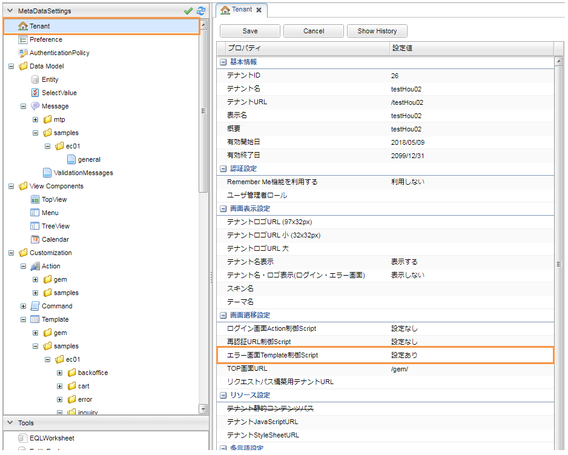
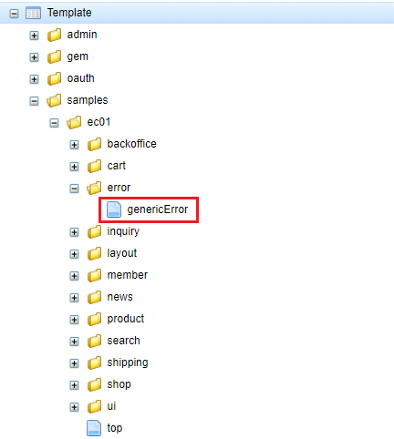

[[Groovy_GTmpl_ErrorUrlSelector]]
=== ErrorUrlSelector
エラー画面Template制御スクリプトクラスです。

* Tokenエラーを例として説明していきます。 + 
Tenantの設定 -> エラー画面Template制御Scriptを開きます。
+

+
[source,Groovy]
----
import org.iplass.mtp.auth.UserExistsException;
import org.iplass.mtp.entity.EntityValidationException;
import org.iplass.mtp.web.WebRequestConstants;
import org.iplass.mtp.web.actionmapping.TokenValidationException;
import samples.ec01.exception.SessionValueNotFoundException;

def error = request."mtp.web.exception";

//ECサイト用
if (path != null && path.startsWith("samples/ec01")) {
	// TokenValidationException用
	if (error instanceof TokenValidationException) { <1>
		return "samples/ec01/error/genericError";
		// EntityValidationException用
	} else if (error instanceof EntityValidationException) {
		return "samples/ec01/error/genericError";
		// UserExistsException
	} else if (error instanceof UserExistsException) {
		return "samples/ec01/error/genericError";
		// SessionValueNotFoundException
	} else if (error instanceof SessionValueNotFoundException) {
		return "samples/ec01/error/genericError";
		// その他のエラー用
	} else {
		return "samples/ec01/error/genericError";
	}
}
----
<1> TokenValidationExceptionが発生した場合、"samples/ec01/error/genericError"テンプレートを呼び出します。

* 共通エラー画面
+

+
[cols="1,2"]
|===
h|Template名|samples/ec01/error/genericError
|===
+ 
[source,Groovy]
----
----------------------------------------以上略----------------------------------------

    

        

        <nav class="breadcrumb all-breadcrumb">
            <a class="breadcrumb-item text-primary" href="${tcPath()}/samples/ec01/top">${msg("samples/ec01/general", "samples.ec01.all.breadcrumb.home")}</a>
            ${msg("samples/ec01/general", "samples.ec01.error.title")}
        </nav>
    

    

        ${msg("samples/ec01/general", "samples.ec01.error.title")}
        

            

                

                    <strong>
				<%	Exception e = (Exception) request."mtp.auth.error";
					if (e == null) {
						e = (Exception) request."mtp.web.exception";
					}
					if (e instanceof LoginFailedException){ %>
						${msg("samples/ec01/general", "samples.ec01.error.loginFailed.msg")}
					<% } else if (e instanceof UserExistsException) { %>
						${msg("samples/ec01/general", "samples.ec01.error.userExists.msg")}
					<% } else if (e instanceof TokenValidationException) { %>
						${msg("samples/ec01/general", "samples.ec01.error.token.msg")} <1>
					<% } else if (e instanceof EntityValidationException) { %>
						${msg("samples/ec01/general", "samples.ec01.error.entityValidation.msg")}
					<% } else if (e instanceof SessionValueNotFoundException) { %>
						${msg("samples/ec01/general", "samples.ec01.error.sessionValueNotFound.msg")}
					<% } else { %>
						${msg("samples/ec01/general", "samples.ec01.error.system.msg")}
					<% } %>
                    </strong>
                

            

        

        

            <a class="btn btn-dark" href="${tcPath()}/samples/ec01/top">${msg("samples/ec01/general", "samples.ec01.error.return")}</a>
        

    

----
<1> TokenValidationExceptionが発生した場合、該当するエラーメッセージを表示します。 + 
※ `${msg()}` は開発者ガイド<<../../developerguide/customizing/index#_groovytemplateの関数,開発者ガイド GroovyTemplateの関数>>の章を参照してください。メタデータとして定義されているメッセージ定義を出力します。

* 動作確認
+
Consoleに出力されたエラーログです。
+
[source]
----
14:48:55.550 [http-nio-8080-exec-14] DEBUG 26 907 samples/ec01/shipping/ConfirmShippingInfoCommand  o.i.m.i.transaction.LocalTransaction - create new Transaction:org.iplass.mtp.impl.transaction.LocalTransaction@36460089 with readOnly=false, stacked:null
14:48:55.555 [http-nio-8080-exec-14] DEBUG 26 907 samples/ec01/shipping/ConfirmShippingInfoCommand  o.iplass.mtp.transaction.Transaction - rollback transaction cause org.iplass.mtp.web.actionmapping.TokenValidationException: 不正な画面遷移が発生しました(一連の登録処理中にブラウザの戻るボタン等を押下してしまいますと正常に処理を継続できない場合があります)。:org.iplass.mtp.impl.transaction.LocalTransaction@36460089
org.iplass.mtp.web.actionmapping.TokenValidationException: 不正な画面遷移が発生しました(一連の登録処理中にブラウザの戻るボタン等を押下してしまいますと正常に処理を継続できない場合があります)。
	at org.iplass.mtp.impl.web.interceptors.TokenInterceptor.doError(TokenInterceptor.java:84)
	at org.iplass.mtp.impl.web.interceptors.TokenInterceptor.intercept(TokenInterceptor.java:114)
	at org.iplass.mtp.impl.command.InvocationImpl.proceedCommand(InvocationImpl.java:115)
	at org.iplass.mtp.impl.web.actionmapping.WebInvocationImpl.proceedCommand(WebInvocationImpl.java:171)
	at org.iplass.mtp.impl.command.interceptors.TransactionInterceptor.lambda$intercept$0(TransactionInterceptor.java:34)
	at org.iplass.mtp.transaction.TransactionManager.doTransaction(TransactionManager.java:114)
	at org.iplass.mtp.transaction.Transaction.with(Transaction.java:303)
	at org.iplass.mtp.impl.command.interceptors.TransactionInterceptor.intercept(TransactionInterceptor.java:33)
	at org.iplass.mtp.impl.command.InvocationImpl.proceedCommand(InvocationImpl.java:115)
	at org.iplass.mtp.impl.web.actionmapping.WebInvocationImpl.proceedCommand(WebInvocationImpl.java:171)
----------------------------------------以下略----------------------------------------
----
+
image:images/sample-ec_groovy-gtmpl-tenant-errorselector-token-error.png[align=left]