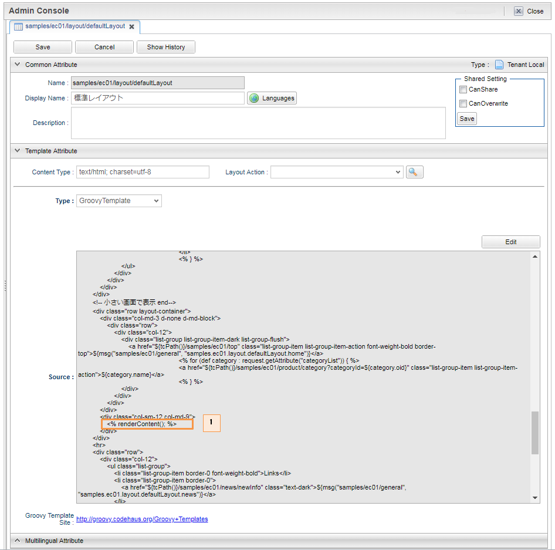
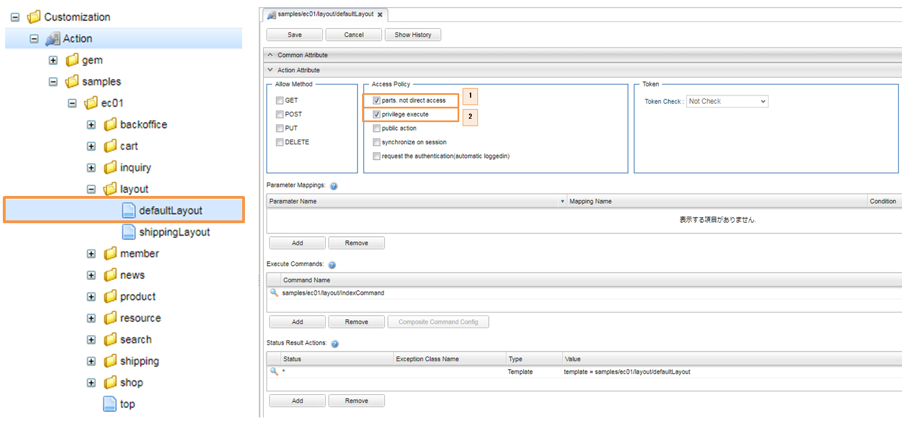

[[Groovy_GTmpl_Layout]]
=== Top画面の作成
* レイアウトの利用 +
Top画面の構成は下図のようになっています。画面共通で利用する2つのレイアウト用テンプレート `defaultLayout` と `shippingLayout` を用意し、画面のメインエリアは機能に併せて呼びだす形にしています。ここでは画面のメインエリアに `top` テンプレートを利用しています。
+

+
レイアウト用テンプレート
+

+
. レイアウト用テンプレート側で、実際のコンテンツを表示したい箇所に
+
[source]
----
<%renderContent(); %>
----
+
を記述します。
+
* レイアウトアクション
+

+
. レイアウトテンプレートは画面パーツとしての利用になるため、 `parts. not direct access` にチェックをいれます。
. `privilege execute` にチェックをいれて特権モードにすると、登録していないユーザーにも公開できます。

* Top画面アクション 
+

+
image:images/sample-ec_groovy-gtmpl-top-layout-action.png[align=left]
+
. Top画面のテンプレートでは、レイアウトアクションに `defaultLayout` を指定しています。