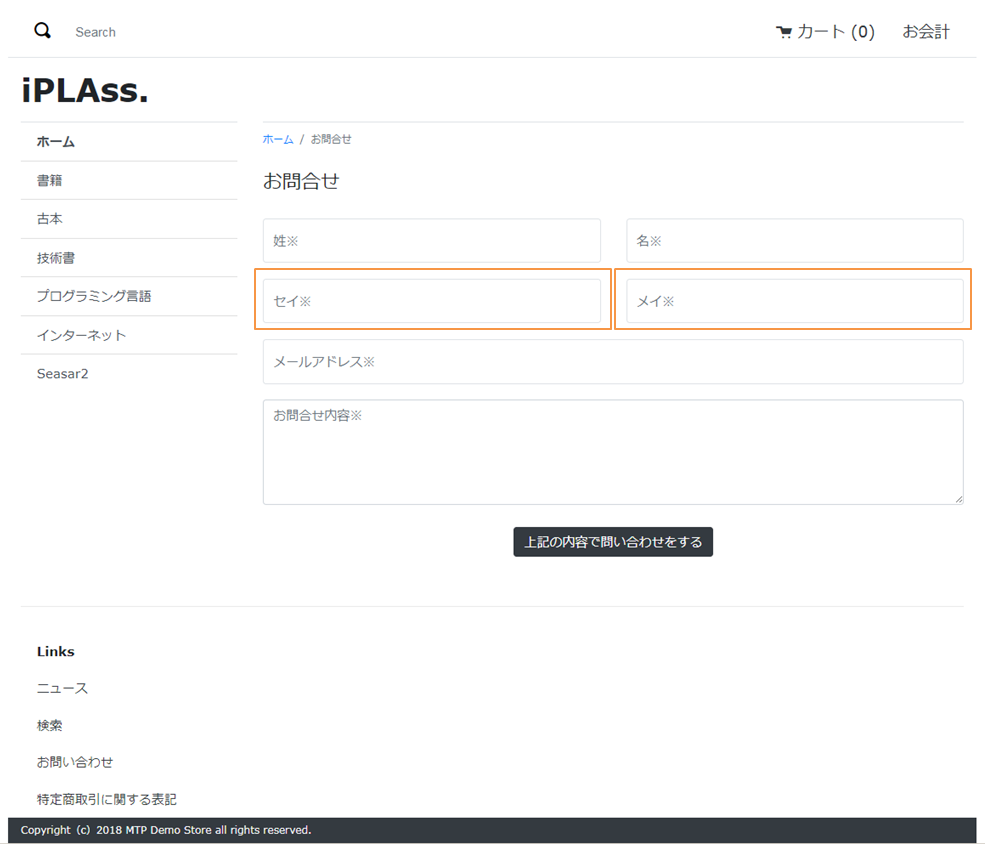
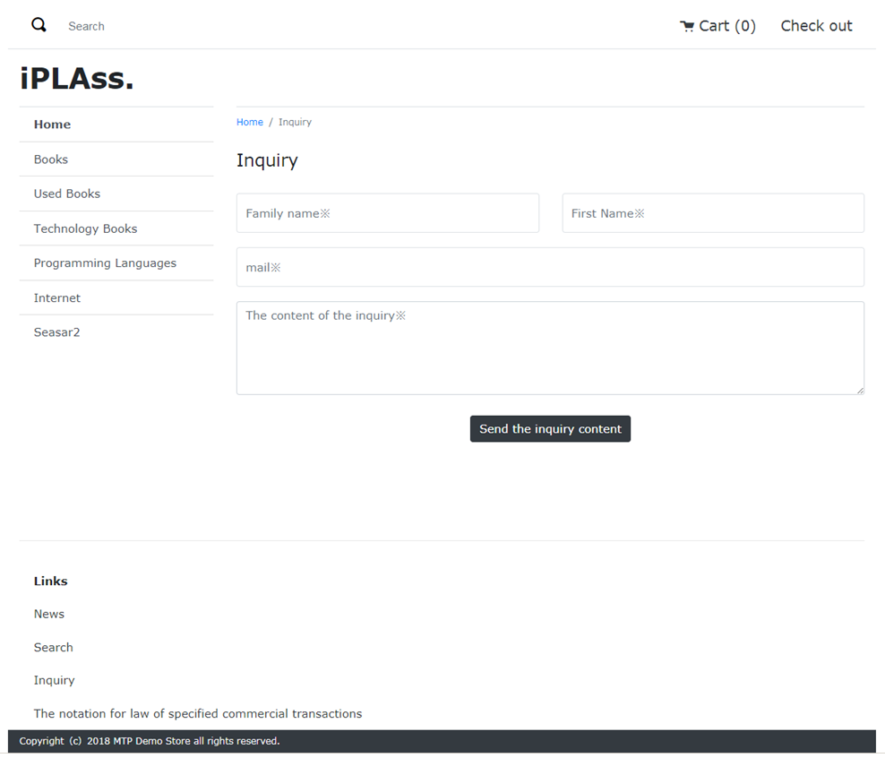
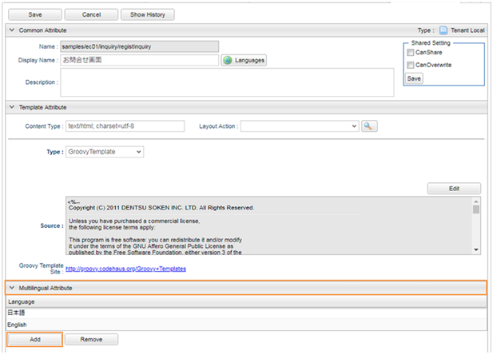
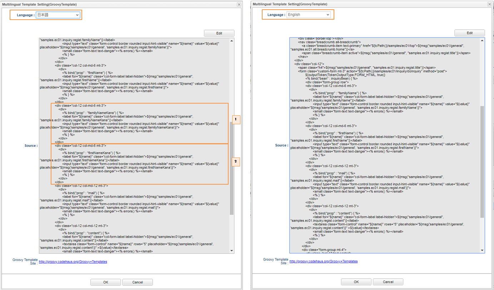

[[Groovy_GTmpl_Multilingual]]
=== 多言語対応テンプレート
* 言語別に同じURLで異なるレイアウトを表示させることが可能です。
+
日本語用お問合せ登録画面
+

+
英語用お問合せ登録画面
+

* 多言語用テンプレートの作成
+
テンプレート画面のMutilingualAttributeを開きAddボタンより日本語用・英語用テンプレートを作成します。
+
※指定した言語のテンプレートが存在しないときには、あらかじめ作成しているテンプレートが表示されます。
+
（Templateのsamples/01/inquiry/registInquiryを参照）
+

+

+
. カタカナ「セイ」の入力項目を日本語用画面に表示させます。
+
. カタカナ「メイ」の入力項目を日本語用画面に表示させます。