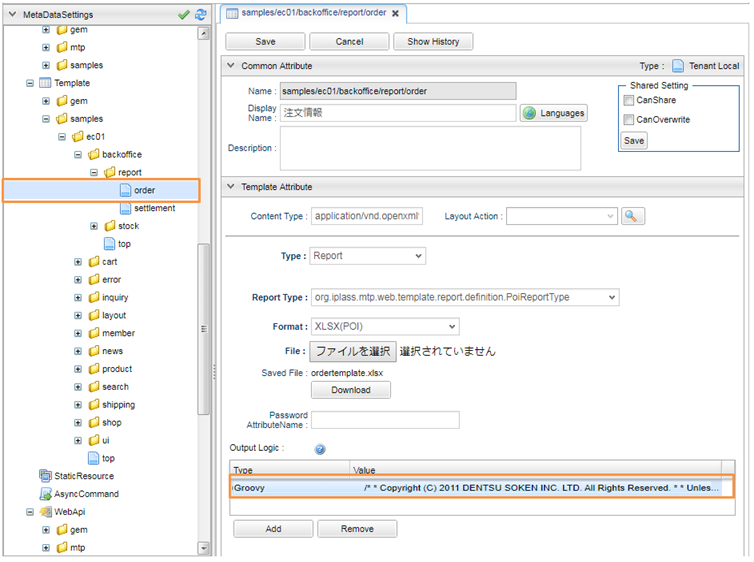
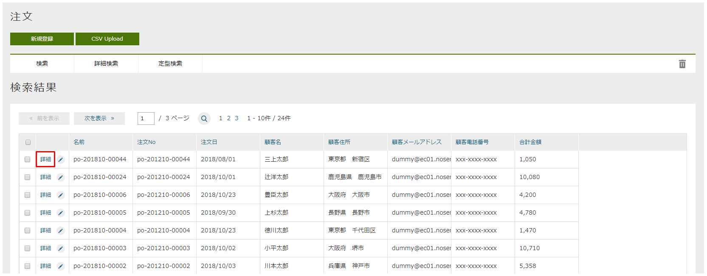
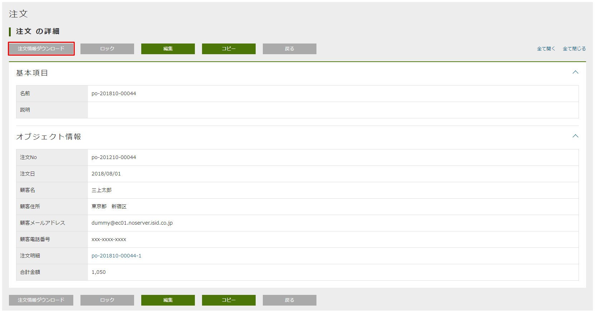
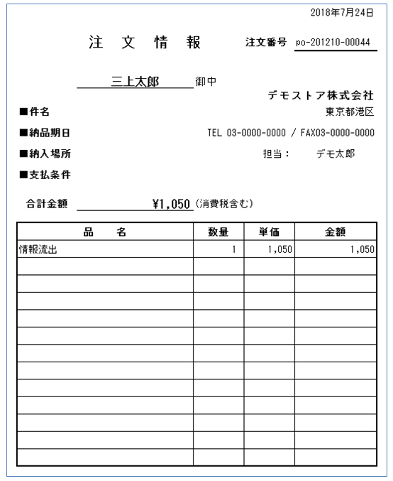

[[Groovy_GTmpl_ReportOutput]]
=== ReportOutput（注文明細ダウンロード）
* POIを用いてExcel形式の注文明細帳票の出力機能を実装しています。
+
* Groovy版では、GroovyScriptを用いてTemplateの「Output Logic」を実装しています。
+

* 帳票テンプレート +
作成方法については、開発者ガイドの<<../../developerguide/report/index#,帳票出力（Jasper/JXLS/POI）>>を参照ください。

* POI帳票出力機能の動作確認
** 管理画面で注文検索一覧画面を開き、「詳細」リンクをクリックします。
+

** 「注文情報ダウンロード」ボタンをクリックします。
+

** ダウンロードしたExcel帳票を確認します。 +
サンプルアプリでは、英語用の帳票テンプレートも別途用意しています。
+

