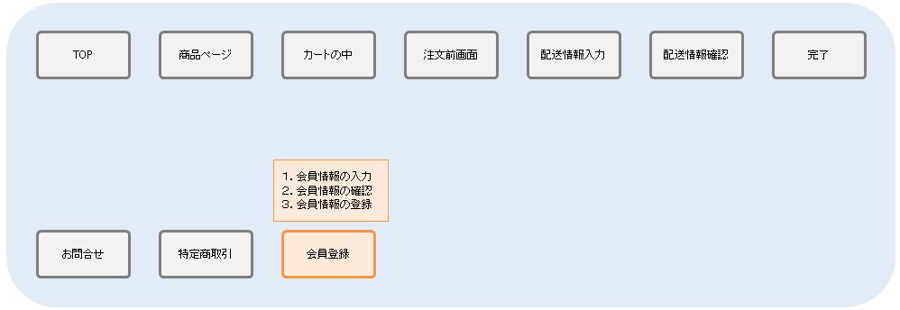

[[Groovy_GTmpl_Security]]
=== セキュリティ対策

.対象とする機能
オレンジ色の部分を例にセキュリティ対策を解説していきます。

.セキュリティ対策について
ここでは会員登録を例としてiPLAssで利用できる以下のセキュリティ対策について説明します。 +
 +
・ XSS対策となるエスケープ機能 ： ユーザーの入力内容を正常に画面表示させる +
・ CSRF対策/トランザクション重複起動対策となるトークンチェック機能 ： 画面表示時に正常な画面遷移が行われているかをチェックする +
 +
会員登録処理の中でそれぞれの機能は下記のように利用されます。

* $エスケープの導入

.Templateの作成
入力された値を出力する会員情報確認画面にて、該当箇所に$エスケープを導入します。

[cols="1,2",options="header"]
|===
|表示名|Template名
|会員情報確認画面|samples/ec01/member/registConfirm
|===

[source]
----
----------------------------------------以上略----------------------------------------
    

        

            

                

                    ${msg("samples/ec01/general", "samples.ec01.member.regist.userId")}
                

                
$h{userBean.userId}
 <1>
            

            

                

                    ${msg("samples/ec01/general", "samples.ec01.member.registConfirm.fullName")}
                

                

                    ${msg("samples/ec01/general", "samples.ec01.member.regist.familyName")}
                    &nbsp;$h{userBean.familyName} <1>
                

                

                    ${msg("samples/ec01/general", "samples.ec01.member.regist.firstName")}
                    &nbsp;$h{userBean.firstName} <1>
                

            

            

                

                    ${msg("samples/ec01/general", "samples.ec01.member.registConfirm.fullNameKana")}
                

                

                    ${msg("samples/ec01/general", "samples.ec01.member.regist.familyNameKana")}
                    &nbsp;$h{userBean.familyNameKana} <1>
                

                

                    ${msg("samples/ec01/general", "samples.ec01.member.regist.firstNameKana")}
                    &nbsp;$h{userBean.firstNameKana} <1>
                

            

            

                

                    ${msg("samples/ec01/general", "samples.ec01.member.regist.mail")}
                

                
$h{userBean.mail}

            

        

    

----------------------------------------以下略----------------------------------------
----
<1> 今回は出力先がHTML形式であるためすべて `$h{変数名}` の形式でエスケープを行っています。詳細は、開発者ガイドの<<../../developerguide/customizing/index#_記述形式, 記述形式>>の章を参照してください。

* TokenCheckの導入 +
* トークンチェックの導入 +
この機能では、iPLAssで実装されている正常に画面遷移してきたことを証明するCSRFトークンを利用します。不正な画面遷移を禁止するActionでトークンをチェックすることにより、正常な画面遷移が行われたかを判断します。

** Actionの設定 +
不正な画面遷移を禁止するActionでトークンをチェックする設定を行います。
+

+
[cols="1,2",options="header"]
|===
|表示名|Action名
|会員情報確認アクション|samples/ec01/member/confirmMemberInfo
|===
+

+
|===
h|Token Check|トークンチェックを行うかどうか
h|use Fixed Token|セッション単位に固定に払いだされるトークンを利用するか
h|consume a Token |トークンを消費するか
h|rollback on exception |Exception発生時にトークンをロールバックするか
|===
+
この設定により直接この画面へ遷移するとエラーページが表示されます。
+

** Templateでトークンを作成して埋め込む +
不正な画面遷移を禁止するActionへ遷移する画面でトークンを作成して埋め込みます。
+

+
[cols="1,2",options="header"]
|===
|表示名|Template名
|会員情報確認画面|samples/ec01/member/regist
|===
+
[source]
----

    

        

        <nav class="breadcrumb all-breadcrumb">
            <a class="breadcrumb-item text-primary" href="${tcPath()}/samples/ec01/top">
            	${msg("samples/ec01/general", "samples.ec01.all.breadcrumb.home")}
            </a>
            
            	${msg("samples/ec01/general", "samples.ec01.member.regist.title")}
            
        </nav>
    

    

        ${msg("samples/ec01/general", "samples.ec01.member.regist.title")}
        <form class="custom-form mt-3" action="${tcPath()}/samples/ec01/member/confirmMemberInfo" method="post">
        <input type="hidden" name="_t" value="${token()}"> <1>
        <% bind("bean" : userBean, "mappingResult" : result) { %>
		    

                

                    

                        <% bind("prop": "userId") { %>
                        <label for="${name}" class="col-form-label label-hidden">${msg("samples/ec01/general", "samples.ec01.member.regist.userId")}</label>
                        <input type="text" class="form-control border rounded input-hint-visible" name="${name}" value="${value}" placeholder="${msg('samples/ec01/general', 'samples.ec01.member.regist.userId')}">
                        <small class="form-text text-danger"><% errors() %></small>
                        <% } %>
                    

                

----------------------------------------以下略----------------------------------------
----
<1> GroovyTemplate関数を利用してトークンを生成しています。