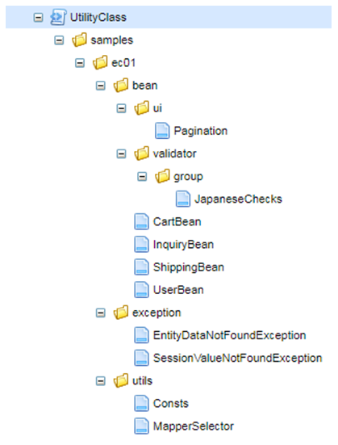
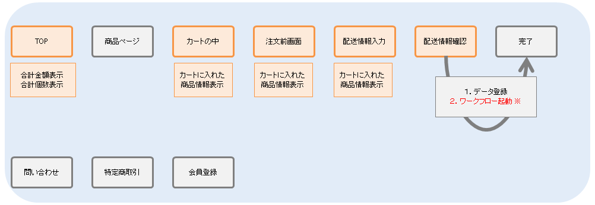
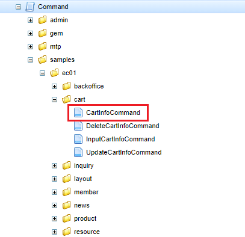
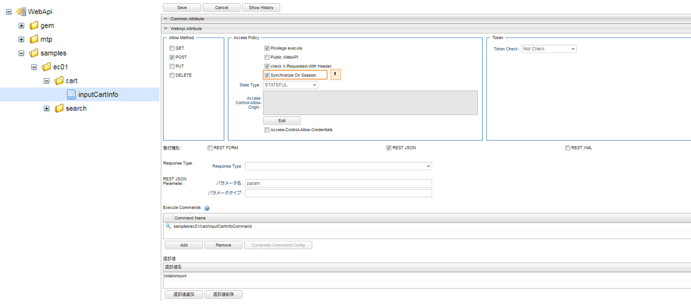

[[Groovy_GTmpl_UtilityClass]]
=== Utility Class
ここでは、Admin Consoleで作成できる `UtilityClass` の利用方法を解説します。 +

* `CartBean` クラスを例として説明していきます。 `CartBean` はオレンジ色の部分で利用されています。
+

+
[red]*※ワークフロー起動はEnterprise Editionの機能です。*

** UtilityClassを作成する際には以下を実装するようにしてください。
+
[cols="1,2"]
|===
h|UtilityClass名|samples.ec01.bean.CartBean
|===
+  
[source,groovy]
----
package samples.ec01.bean; <1>

import java.io.Serializable;
import java.util.ArrayList;
import java.util.List;
import java.util.Map;
import jakarta.validation.Valid;
import jakarta.validation.constraints.Min;
import jakarta.validation.constraints.NotBlank;
import samples.ec01.utils.Consts;

class CartBean implements Serializable {
	private static final long serialVersionUID = 8770008117231095046L; <2>
	
    // カートの商品リスト
	@Valid
	List<CartItem> cartItems = new ArrayList<CartItem>();
	// カートの総額値段
	long totalPrice = 0;

	// コンストラクタ
	public CartBean() {
	}

	// カートに商品を追加
	synchronized public void addCartItem(String productId, long price) {
		for (CartItem item : this.cartItems) {

			// 商品が既に追加されていたらValueを１増加
			if (item.productId == productId) {
				item.value = item.value + 1;
				totalPrice += price;
				return;
			}
		}

		// 商品が無かった場合には初期値１が入ったCartItemを追加
		this.cartItems.add(new CartItem(productId));
		totalPrice += price;
	}

	// カートの商品を削除
	synchronized public void removeCartItem(String productId, long price) {
		for (int index = 0; index < this.cartItems.size(); index++) {
			CartItem item = this.cartItems.get(index);
			if (item.productId == productId) {
				this.cartItems.remove(index);
				totalPrice = totalPrice - price * item.value;
				return;
			}
		}
	}
----------------------------------------以下略----------------------------------------
----
<1> package階層はUtilityClassを作成した階層と同一にします。
<2> Serializableを実装する場合（作成したクラスをSessionに格納する場合）、serialVersionUIDを忘れずに定義してください。

** UtilityClassの利用 +
新たに商品をカートに追加するコマンドを例に、UtilityClassの利用方法を説明します。
+
.カートに入れるコマンド
+

+
[cols="1,2"]
|===
h|Commandクラス|samples/ec01/cart/InputCartInfoCommand
|===
+
[source,groovy]
----
import org.iplass.mtp.entity.LoadOption;
import samples.ec01.bean.CartBean; <1>

def productId = request.getParam("productId");
def cartBean = request.getSession().cartBean; <2>

if (cartBean == null) {
	println "セッションにカートなし";
	println "セッションに新しいカート作成";
	cartBean = new CartBean();
	request.getSession().cartBean = cartBean;
} else {
	println "セッションにカートあり";
	println "：総計：${cartBean.totalPrice}";
}

def product = em.load(productId, "samples.ec01.products.Product",
    new LoadOption().localized());
def price = product.price;
cartBean.addCartItem(productId, price);
println "：総計2： ${cartBean.totalPrice}";

request.totalAmount = cartBean.getTotalAmount();

"SUCCESS";
----
<1> UtilityClassで作成したクラスも他のクラスと同じように利用できます。
<2> このようにSessionに格納して利用する場合には、Serializableを実装しないと不整合を起こす原因となる可能性があります。

** 補足: WebApiでの設定
+
Cartオブジェクトは同期をとって利用したいため、 `Synchronize on Session` を使用しています。
+

