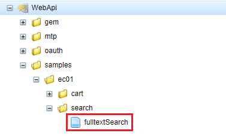
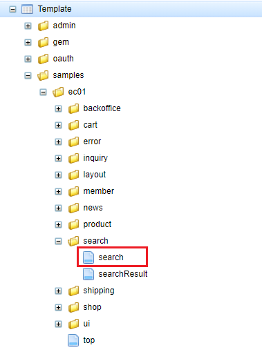

[[Groovy_GTmpl_WebAPI]]
=== WebApiとの連携

Ajaxを利用することで、GroovyTemplateでWebApiと連携することが出来ます。一般消費者向け画面で全文検索処理を例として説明していきます。

* 開発者ガイド<<../../developerguide/webapi/index#, WebApi>>を参照してください。 + 
以下はここで利用しているWebApiです。
+

+
[cols="1,2"]
|===
h|WebApi名|samples/ec01/search/fulltextSearch
|===

* WebApiを利用しているテンプレート
+

+
[cols="1,2"]
|===
h|Template名|samples/ec01/search/search
|===
+
[source]
----
----------------------------------------GroovyTemplateの部分略----------------------------------------

----------------------------------------以下略----------------------------------------
----
<1> WebApiによる検索処理を呼び出します。
<2> 検索処理でエラーが発生した場合、クライアント側での処理。
<3> 返された検索処理の結果を取得し、クライアント側の描画処理を呼び出します。
<4> 検索結果の描画処理。

* 動作確認
+
動作結果はJava／JSP版と同じなので、そちらの<<../javajsp/index#Java_JSP_WebAPI_Operation_Check,動作確認>>画面を参照してくださん。