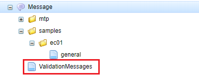
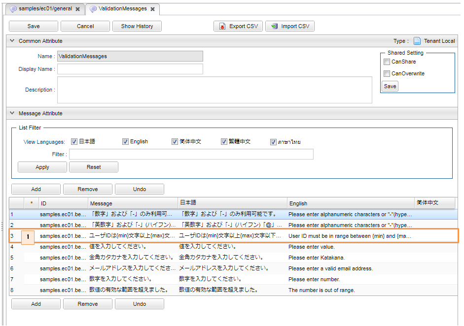

[[Groovy_Gtmpl_Resource_BeanValidation]]
=== Bean Validationエラーメッセージ
* 言語別にメッセージ定義(メタデータ）を作成することで多言語利用が可能です。
+

+
[cols="1,2"]
|===
h|Message名|ValidationMessages
|===
+

+
. メッセージにパラメータを利用することが可能です。

* 補足 + 
※ サンプルではValidationエラーメッセージの定義を `/message` の直下に入れています。もしカスタムのパスに入れたい場合、以下のようにservice-configに `org.iplass.mtp.impl.validation.ValidationService` の定義を上書きしなければならないです。
+
[source,xml]
----
	<service>
		<interfaceName>org.iplass.mtp.impl.validation.ValidationService</interfaceName>
		<className>org.iplass.mtp.impl.validation.ValidationService</className>
		<property name="beanValidation">
			<property name="providerClass" value="org.hibernate.validator.HibernateValidator" />
			<property name="messageInterpolator" className="org.iplass.mtp.impl.validation.bean.TenantContextMessageInterpolator">
				<property name="messageInterpolatorFactory" className="org.iplass.mtp.impl.validation.bean.hibernate.HibernateMessageInterpolatorFactory">
					<property name="resourceBundleLocator" className="org.iplass.mtp.impl.validation.bean.hibernate.MessageResourceBundleLocator">
						<property name="bundleName" value="[カスタムのパス]/ValidationMessages" />   <1>
					</property>
					<property name="cachingEnabled" null="true" />
				</property>
			</property>
		</property>
	</service>
----
<1> Validationエラーメッセージ定義のパスを[カスタムのパス]/ValidationMessagesに変更します。