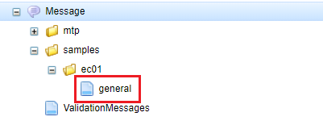
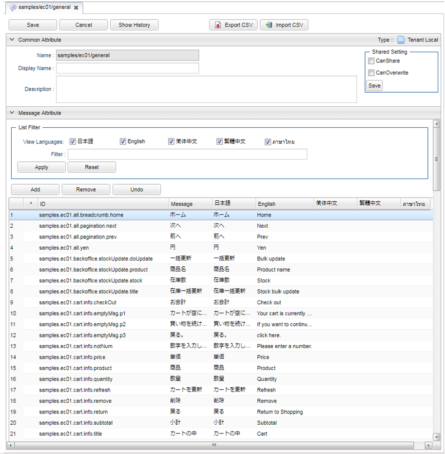

[[Groovy_GTmpl_Resource_Message]]
=== 多言語メッセージ
* GroovyTemplateで特定のメッセージ定義（メタデータ）、またはResourceBundleに定義された文字列を取得することができ、言語別にメッセージ定義を作成することで多言語利用が可能です。 +
取得方法については、開発者ガイドの<<../../developerguide/customizing/index#_groovytemplateの関数,GroovyTemplateの関数>>の `${rs()}` と `${msg()}` 関数を参照してください。 +
 + 
サンプルアプリでは、メタデータとして定義しています。
+

+
[cols="1,2"]
|===
h|Message名|samples/ec01/general
|===
+
