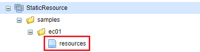
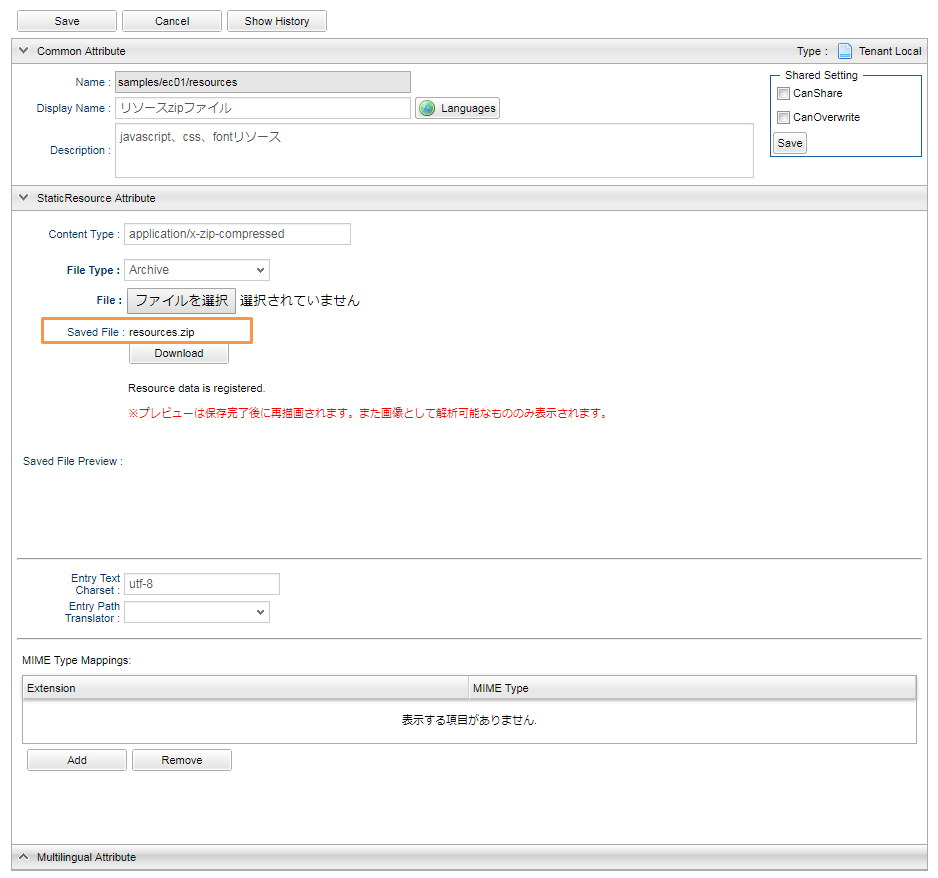
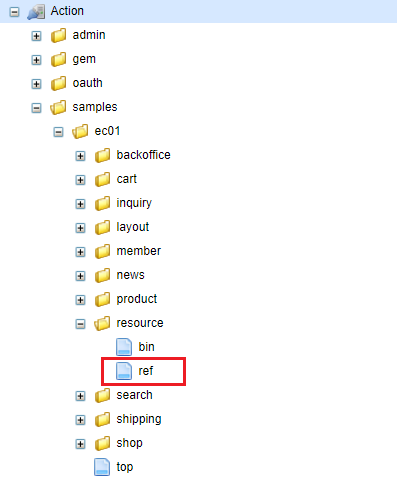

[[Groovy_GTmpl_StaticResource]]
=== StaticResource
* サンプルアプリでは、JavaScript、CSS、FontファイルをZip形式の圧縮ファイルにしてメタデータとして登録しています。
+

+
[cols="1,2"]
|===
h|StaticResource名|samples/ec01/resources
|===
+

+
resources.zipファイルを解凍したディレクトリ構造は以下の通りです。
+
[source]
----
resources
	┣ scripts <1>
	┗ styles <2>
		┗ fonts <3>
----
<1> JavaScriptリソースのフォルダ
<2> CSSリソースのフォルダ
<3> Fontリソースのフォルダ

* Actionの作成
+
上記の圧縮ファイルにエントリされたリソースファイルを指定するActionを作成します。
+

+
[cols="1,2"]
|===
h|Action名|samples/ec01/resource/ref
|===

* GroovyTemplateでアクセスする例
+
[source]
----
<%@ page import="org.iplass.mtp.web.template.TemplateUtil"%>

<!DOCTYPE html>
<html lang="<%=TemplateUtil.getLanguage() %>">
<%
	def totalAmount = request.totalAmount;
%>
<head>
	<!-- Required meta tags -->
	<meta charset="utf-8">
	<meta name="viewport" content="width=device-width, initial-scale=1, shrink-to-fit=no">
	<!-- Optional meta tags -->
	<meta name="keywords" content="キーワードその1,キーワードその2,キーワードその3,キーワードその4,キーワードその5" />
	<meta name="description" content="ご自身のWebサイトの説明を記載します" />
    <!-- Bootstrap CSS -->
    <link rel="stylesheet" href="${tcPath()}/samples/ec01/resource/ref/styles/bootstrap.min.css?cv=<%=TemplateUtil.getAPIVersion()%>"> <1>
    <link rel="stylesheet" href="${tcPath()}/samples/ec01/resource/ref/styles/open-iconic-bootstrap.min.css?cv=<%=TemplateUtil.getAPIVersion()%>"> <1>
    <link rel="stylesheet" href="${tcPath()}/samples/ec01/resource/ref/styles/bookstore.css?cv=<%=TemplateUtil.getAPIVersion()%>"> <1>
</head>
----------------------------------------以下略----------------------------------------
----
<1> `{コンテキストルート}/{テナント名}/resource/ref/` のURLパスで、リソースファイルを取得します。
+
※ 詳しくは、開発者ガイドの<<../../developerguide/customizing/index#StaticResource, Static Resource>>の章を参照してください。