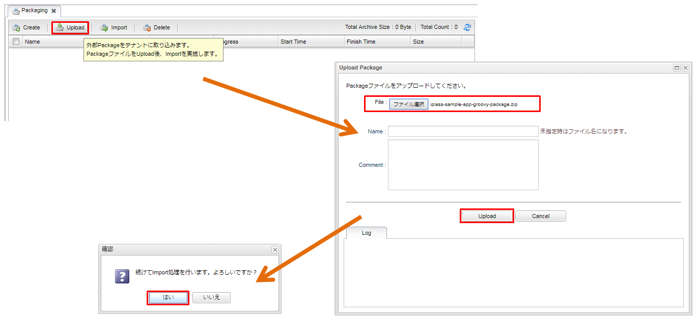
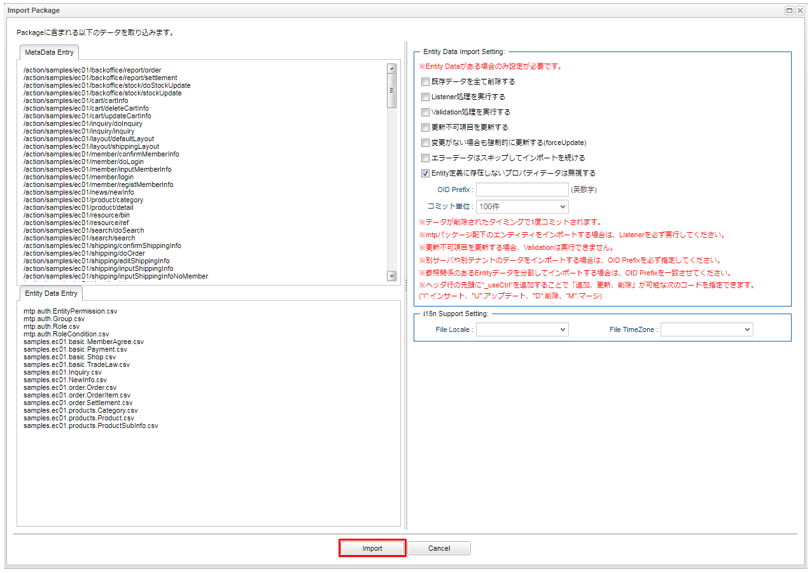
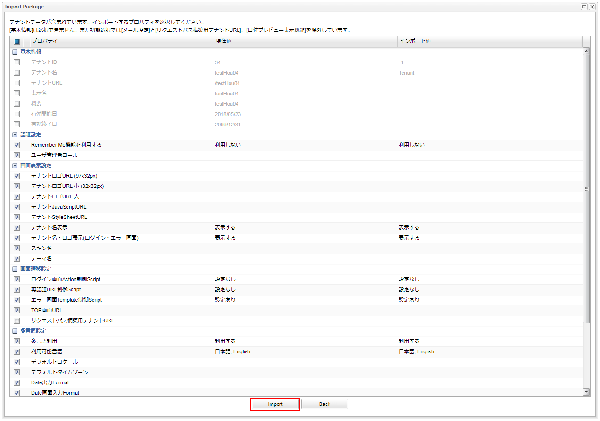
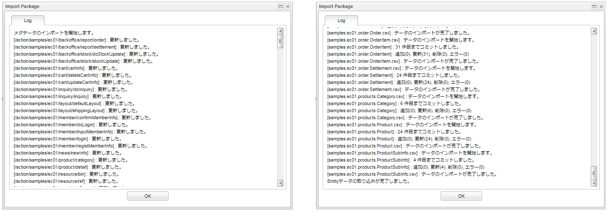
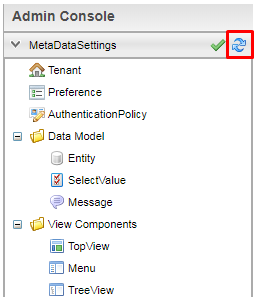
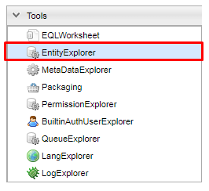
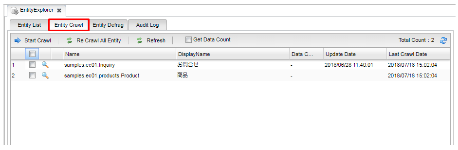
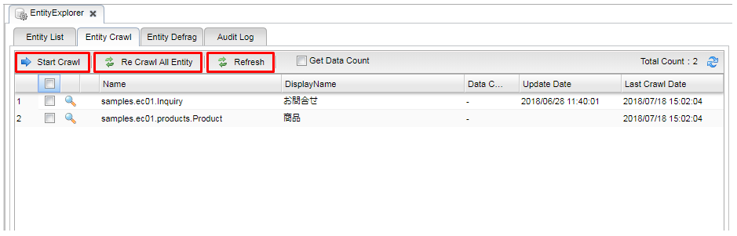

[[Groovy_GTmpl_Setup]]
== セットアップ
サンプルアプリケーションのセットアップ説明です。 +
もし、既にiPLASSの<<../../gettingstarted/gettingstarted/index#,Install and Run>>または<<../../gettingstarted/installguide/index#,開発環境の構築>>を実行できた方で、サンプルアプリケーションを動かしたい場合、以下の手順に従って実施してみてください。 +
それ以外の方は<<../../gettingstarted/gettingstarted/index#,Install and Run>>から実際に動かしてみることをお勧めします。

* サンプルアプリケーションのzipファイルをlink:https://iplass.org/downloads/[ダウンロードサイト]からダウンロードします。

* <<../../gettingstarted/gettingstarted/index#,Install and Run>>の章で作成したTenant、または<<../../gettingstarted/installguide/index#,開発環境の構築>>の章でEclipse上で作成したTenant、どちらかを利用してWebアプリケーションを立ち上げて管理者IDとパスワードでログインします。

.サンプルアプリの起動手順

. `Admin Console` の `Packaging` 機能を利用してzipファイルをインポートします。
+
ダウンロードした「iplass-sample-app-groovy-package.zip」ファイルを、AdminConsoleの「Packaging」ツールで取り込んでください。
+

+
デフォルトの設定で「import」ボタンを押下してください。
+

+
「iplass-sample-app-groovy-package.zip」ファイルにテナント情報が含まれているため、「import」ボタン押下後に以下の画面が表示されます。
チェックがついている項目は上書きされてしまうため、独自に設定した項目についてはチェックを外してimportしてください。
+

+
Importを実行すると「Log」パネルに処理状況が表示されます。処理が終了したタイミングでエラーが発生していないことを確認してください。
+

+
新たに作成したロールなどを反映させるために、メタデータのキャッシュを削除してください。
+

. サンプルが全文検索機能（lucene）を利用しますので、service-configに書いてあるINDEXデータファイルの仮の保存場所をローカル環境の適当な場所に変えます。
+
[source,xml]
----
<service>
    <interface>org.iplass.mtp.impl.fulltextsearch.FulltextSearchService</interface>
    <property name="useFulltextSearch" value="true" /> <1>
    <property name="maxRows" value="1000" />
    <property name="throwExceptionWhenOverLimit" value="true"/>

    <!-- lucene利用 -->

    <class>org.iplass.mtp.impl.fulltextsearch.lucene.LuceneFulltextSearchService</class>
    <property name="directory" value="D:\tmp\lucene" /> <2>
    <property name="defaultOperator" value="AND" />
    <property name="analyzer" value="org.apache.lucene.analysis.ja.JapaneseAnalyzer" />
    <property name="indexWriterRAMBufferSizeMB" value="64.0"/>
    <property name="redundantTimeMinutes" value="10"/>

    <!-- BinaryReferenceのParse可能な最大文字数 -->
    <property name="binaryParseLimitLength" value="100000"/>
</service>
----
<1> useFulltextSearchをtrueに設定します。
<2> INDEXファイル保存場所をローカルパスに設定します。
+
iPLAssのインストーラでWebアプリケーションを起動した場合、ホームディレクトリに作成された設定ファイルを更新してください。
+
[source]
----
%HOMEPATH%\.iplass\iplass-service-config.xml
----
+
EclipseからWebアプリケーションを起動した場合、プロジェクトフォルダにある設定ファイルを更新してください。
+
[source]
----
src/main/resources/mtp-service-config.xml
----

. `Admin Console` の `EntityExplorer` で `Entity Crawl` 機能を利用してインデックスファイルを作り直します。
+
ToolsのEntityExplorerを選択します。
+

+
全文検索を利用する設定になっている場合、「Entity Crawl」タブが表示されます。
+

+
A) 任意のEntityのみを対象としてクローリングしたい場合はリストのEntityにチェックをいれ、「Start Crawl」ボタンをクリックして下さい。
+
B) クローリング対象Entityを全てクローリングしたい場合は「Re Crawl All Entity」ボタンをクリックして下さい。この場合、チェックをいれていないEntityも全てが対象となります。
+
C) クローリングが完了しましたら、最新のINDEXデータを反映させるために、「Refresh」ボタンをクリックして下さい。
+

. 上記起動手順の実施が完了しましたら、<<../index#GlobalSettings,サンプルアプリのグローバル設定>>を確認してください。