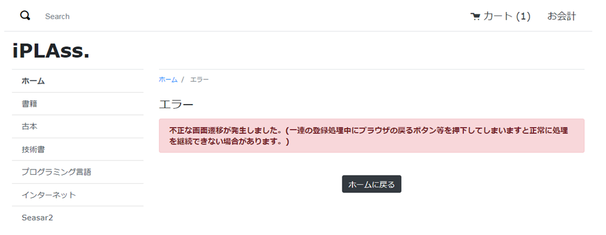

[[Java_JSP_ErrorUrlSelector]]
=== ErrorUrlSelector
エラー画面Template制御スクリプトです。

* トークンエラーが発生した場合を例として説明していきます。
+
[cols="1,2"]
|===
h|ファイル名|src/main/java/samples/ec01/web/EcErrorUrlSelector.java
|===
+
[source,java]
----
public class EcErrorUrlSelector extends GemErrorUrlSelector {

	private final String ROOT_PATH = "samples/ec01";
	private final String TEMPURL_TOKEN_ERROR = ROOT_PATH + "/error/tokenError";
	private final String TEMPURL_ENTITY_ERROR = ROOT_PATH + "/error/entityError";
	private final String TEMPURL_USER_EXISTS_ERROR = ROOT_PATH + "/error/userExistsError";
	private final String TEMPURL_SESSION_VALUE_NOT_FOUND_ERROR = ROOT_PATH + "/error/sessionValueNotFoundError";
	private final String TEMPURL_SYSTEM_ERROR = ROOT_PATH + "/error/systemError";

	@Override
	public String getErrorTemplateName(Throwable exception, RequestContext request, String path) {
		Exception error = (Exception) request.getAttribute(WebRequestConstants.EXCEPTION);
		// ECサイト用
		if (path != null && path.startsWith(ROOT_PATH)) {
			// TokenValidationException用
			if (error instanceof TokenValidationException) {
				return TEMPURL_TOKEN_ERROR; <1>
				// EntityValidationException用
			} else if (error instanceof EntityValidationException) {
				return TEMPURL_ENTITY_ERROR;
				// UserExistsException
			} else if (error instanceof UserExistsException) {
				return TEMPURL_USER_EXISTS_ERROR;
				// SessionValueNotFoundException
			} else if (error instanceof SessionValueNotFoundException) {
				return TEMPURL_SESSION_VALUE_NOT_FOUND_ERROR;
				// その他のエラー用
			} else {
				return TEMPURL_SYSTEM_ERROR;
			}
		}
		return super.getErrorTemplateName(exception, request, path);
	}
}
----
<1> TokenValidationExceptionが発生した場合、カスタムの `samples/ec01/error/tokenError` テンプレートが呼び出されます。 +

* カスタムのErrorUrlSelectorの実装クラスを `mtp-service-config.xml` に登録する必要があります。<<index#Java_JSP_ConfigFiles,設定ファイル>>を参照ください。

* メタデータ定義ファイル
+
[cols="1,2"]
|===
h|ファイル名|samples-ec01-ce-metadata.xml
|===
+

[source,xml]
----
<contextPath name="/template">
----------------------------------------以上略----------------------------------------
	<!-- エラー画面 -->
	<metaDataEntry>
		<metaData xmlns:xsi="http://www.w3.org/2001/XMLSchema-instance"
			xsi:type="metaJspTemplate">
			<name>samples/ec01/error/tokenError</name> <1>
			<displayName>トークンエラー画面</displayName> 
			<path>/jsp/samples/ec01/error/genericError.jsp</path> <2>
			<layoutId>/action/samples/ec01/layout/defaultLayout</layoutId>
			<contentType>text/html; charset=utf-8</contentType>
		</metaData>
	</metaDataEntry>
----------------------------------------以下略----------------------------------------
----
<1> トークンエラー画面のテンプレート名
<2> エラーテンプレートファイルを指定

* 共通エラーテンプレートファイル
+
[cols="1,2"]
|===
h|ファイル名|/src/main/webapp/jsp/samples/ec01/error/genericError.jsp
|===

* 動作確認
** TokenValidationExceptionが発生した場合、カスタムのテンプレートが表示されること。
+
コンソールに出力されたエラーログは以下の通りです。
+
[source]
----
org.iplass.mtp.web.actionmapping.TokenValidationException: 不正な画面遷移が発生しました(一連の登録処理中にブラウザの戻るボタン等を押下してしまいますと正常に処理を継続できない場合があります)。
	at org.iplass.mtp.impl.web.interceptors.TokenInterceptor.doError(TokenInterceptor.java:84)
	at org.iplass.mtp.impl.web.interceptors.TokenInterceptor.intercept(TokenInterceptor.java:114)
	at org.iplass.mtp.impl.command.InvocationImpl.proceedCommand(InvocationImpl.java:115)
	at org.iplass.mtp.impl.web.actionmapping.WebInvocationImpl.proceedCommand(WebInvocationImpl.java:171)
	at org.iplass.mtp.impl.command.interceptors.TransactionInterceptor.lambda$intercept$0(TransactionInterceptor.java:34)
	at org.iplass.mtp.transaction.TransactionManager.doTransaction(TransactionManager.java:114)
	at org.iplass.mtp.transaction.Transaction.with(Transaction.java:303)
	at org.iplass.mtp.impl.command.interceptors.TransactionInterceptor.intercept(TransactionInterceptor.java:33)
----

** エラー内容表示
+
