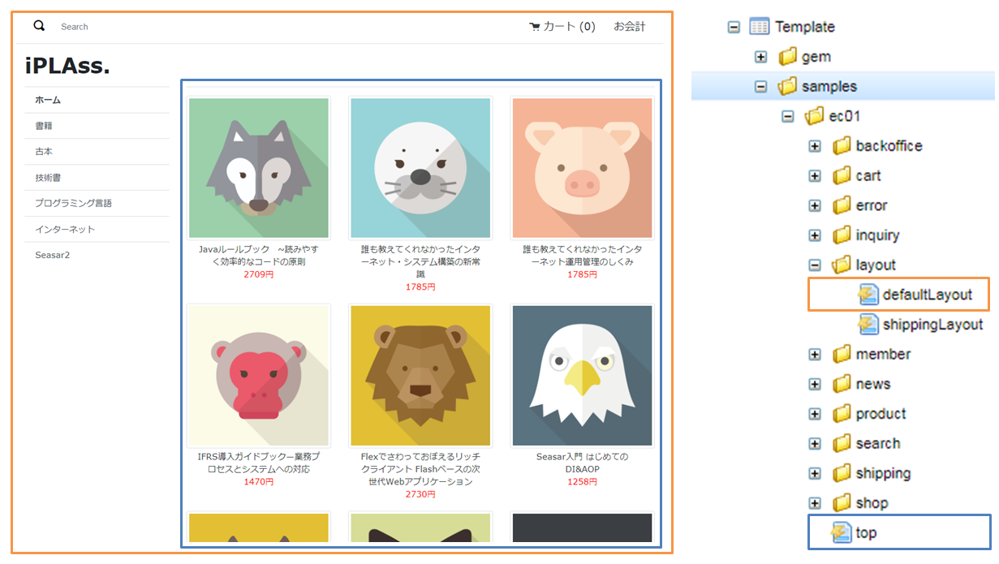

[[Java_JSP_Layout]]
=== Top画面の作成
* レイアウトの利用 +
Top画面の構成は下図のようになっています。画面共通で利用する2つのレイアウト用テンプレート `defaultLayout` と `shippingLayout` を用意し、画面のメインエリアは機能に併せて呼びだす形にしています。ここでは画面のメインエリアに `top` テンプレートを利用しています。
+

+
[cols="1,2"]
|===
h|ファイル|src/main/webapp/jsp/samples/ec01/layout/defaultLayout.jsp
|===
+
[source,jsp]
----
<%@ page language="java" contentType="text/html; charset=utf-8" pageEncoding="utf-8"%>
<%@ page import="org.iplass.mtp.web.template.TemplateUtil"%>
<%@ page import="samples.ec01.utils.URLHelper" %>
<%@ taglib prefix="m" uri="http://iplass.org/tags/mtp"%> <1>
<%@ taglib prefix="c" uri="jakarta.tags.core"%>

----------------------------------------以上略----------------------------------------
        <!-- 小さい画面で表示 end-->
        

            

                

                    

                        

                            <a href="${m:tcPath()}/samples/ec01/top" class="list-group-item list-group-item-action fw-bold border-top">${m:rs('iplass-wtp-messages', 'samples.ec01.layout.defaultLayout.home')}</a>
							<c:forEach var="category" items="${categoryList}">
								<a href="${URLHelper.getCategoryPath(category.oid)}" class="list-group-item list-group-item-action">${category.name}</a>
							</c:forEach>
                        

                    

                

            

            

            	<m:renderContent /> <2>
            

        

        

        

            

                <ul class="list-group">
                    <li class="list-group-item border-0 fw-bold">Links</li>
                    <li class="list-group-item border-0">
                        <a href="${m:tcPath()}/samples/ec01/news/newInfo" class="text-dark">${m:rs('iplass-wtp-messages','samples.ec01.layout.defaultLayout.news')}</a>
                    </li>
                    <li class="list-group-item border-0">
                        <a href="${m:tcPath()}/samples/ec01/search/search" class="text-dark">${m:rs('iplass-wtp-messages','samples.ec01.layout.defaultLayout.search')}</a>
                    </li>
                    <li class="list-group-item border-0">
                        <a href="${m:tcPath()}/samples/ec01/inquiry/inquiry" class="text-dark">${m:rs('iplass-wtp-messages','samples.ec01.layout.defaultLayout.inquiry')}</a>
                    </li>
                    <li class="list-group-item border-0">
                        <a href="${m:tcPath()}/samples/ec01/shop/tradeLaw" class="text-dark">${m:rs('iplass-wtp-messages','samples.ec01.layout.defaultLayout.SCTAInfo')}</a>
                    </li>
                </ul>
            

        

----------------------------------------以下略----------------------------------------
----
<1> iPLAssのJSPタグライブラリ
<2> LayoutテンプレートのJSPにおいて、メインコンテンツを表示する箇所を指定するJSPタグです。

* メタデータ定義ファイル
+
[cols="1,2"]
|===
h|ファイル名|samples-ec01-ce-metadata.xml
|===
+
[source,xml]
----
<contextPath name="/template">
----------------------------------------以上略----------------------------------------
	<!-- レイアウト -->
	<metaDataEntry>
		<metaData xmlns:xsi="http://www.w3.org/2001/XMLSchema-instance"
			xsi:type="metaJspTemplate">
			<name>samples/ec01/layout/defaultLayout</name>
			<displayName>標準レイアウト</displayName>
			<path>/jsp/samples/ec01/layout/defaultLayout.jsp</path> <1>
			<contentType>text/html; charset=utf-8</contentType>
		</metaData>
	</metaDataEntry>
	......
	<metaDataEntry>
		<metaData xmlns:xsi="http://www.w3.org/2001/XMLSchema-instance"
			xsi:type="metaJspTemplate">
			<name>samples/ec01/top</name>
			<displayName>Top画面</displayName>
			<path>/jsp/samples/ec01/top.jsp</path> <2>
			<layoutId>/action/samples/ec01/layout/defaultLayout</layoutId> <3>
			<contentType>text/html; charset=utf-8</contentType>
		</metaData>
	</metaDataEntry>

----------------------------------------以下略----------------------------------------
----
<1> レイアウト用のテンプレートファイルを指定しています。
<2> Top画面用のテンプレートファイルを指定しています。
<3> Top画面のテンプレートでは、 `layoutId` にレイアウト用テンプレートを指定しています。