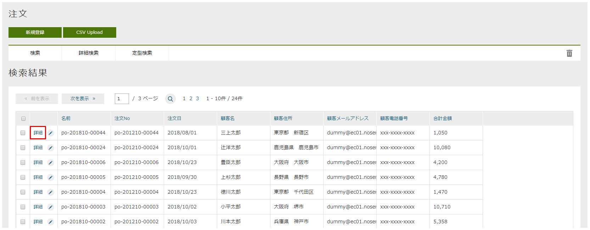
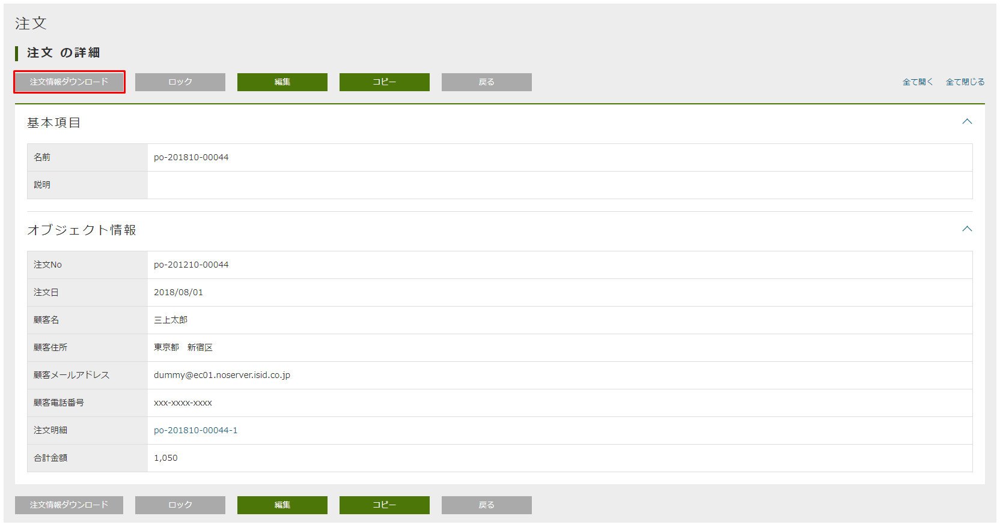
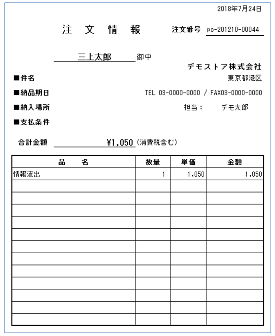

[[Java_JSP_ReportOutput]]
=== ReportOutput（注文明細ダウンロード）
* POIを用いてExcel形式の注文明細帳票の出力機能を実装しています。
+
* Java/JSP版では、Javaクラスを用いてTemplateのOutput Logicを実装しています。
+
[cols="1,2"]
|===
h|ファイル名|samples.ec01.template.report.OrderOutputLogic
|===

* 帳票テンプレート +
作成方法は、開発者ガイド<<../../developerguide/report/index#, 帳票出力（Jasper/JXLS/POI）>>の章をご参照ください。

* POI帳票出力機能の動作確認

** 管理用画面で注文検索一覧画面を開き、詳細リンクをクリックします。
+

** 「注文明細ダウンロード」ボタンをクリックします。
+

** ダウンロードしたExcel帳票を確認します。 +
このサンプルでは、英語用の帳票テンプレートも別途用意しています。
+

