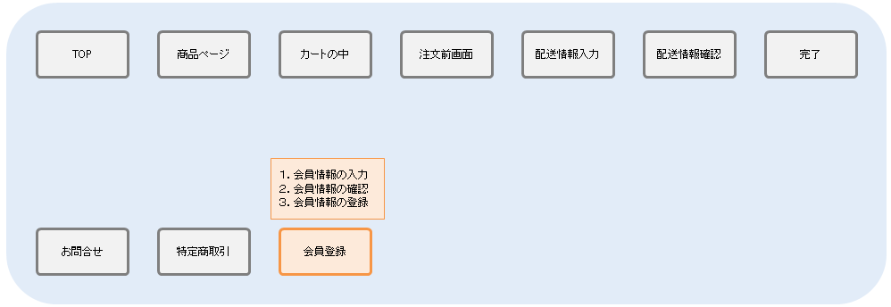
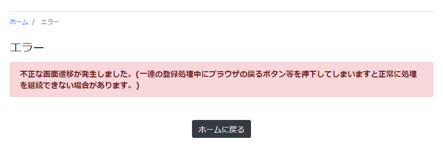

[[Java_Jsp_Security]]
=== セキュリティ対策

.対象とする機能
オレンジ色の部分を例にセキュリティ対策を解説していきます。

.セキュリティ対策について
ここでは会員登録を例としてiPLAssで利用できる以下のセキュリティ対策について説明します。 +
 +
・ XSS対策となるエスケープ機能 ： ユーザーの入力内容を正常に画面表示させる +
・ CSRF対策/トランザクション重複起動対策となるトークンチェック機能 ： 画面表示時に正常な画面遷移が行われているかをチェックする +
 +
会員登録処理の中でそれぞれの機能は下記のように利用されます。

* エスケープの導入 +

.Templateの作成
入力された値を出力する会員情報確認画面にて、該当箇所に `${m:esc()}` エスケープを導入します。

[cols="1,2",options="header"]
|===
|表示名|Template名
|会員情報確認画面|samples/ec01/member/confirmMemberInfo
|===

[source,jsp]
----
<%@ taglib prefix="m" uri="http://iplass.org/tags/mtp"%> <1>
----------------------------------------以上略----------------------------------------
		

			

				

					

						${m:rs('iplass-wtp-messages', 'samples.ec01.member.regist.userId')}
					

					
${m:esc(userBean.userId)}

				

				

					

						${m:rs('iplass-wtp-messages', 'samples.ec01.member.registConfirm.fullName')}
					

					

						${m:rs('iplass-wtp-messages', 'samples.ec01.member.regist.familyName')}
						&nbsp;${m:esc(userBean.familyName)} <2>
					

					

						${m:rs('iplass-wtp-messages', 'samples.ec01.member.regist.firstName')}
						&nbsp;${m:esc(userBean.firstName)} <2>
					

				

				<% if (Consts.LANGUAGE_JA.equals(TemplateUtil.getLanguage()) || TemplateUtil.getLanguage() == null) { %>
				

					

						${m:rs('iplass-wtp-messages', 'samples.ec01.member.registConfirm.fullNameKana')}
					

					

						${m:rs('iplass-wtp-messages', 'samples.ec01.member.regist.familyNameKana')}
						&nbsp;${m:esc(userBean.familyNameKana)} <2>
					

					

						${m:rs('iplass-wtp-messages', 'samples.ec01.member.regist.firstNameKana')}
						&nbsp;${m:esc(userBean.firstNameKana)} <2>
					

				

				<% } %>
				

					

						${m:rs('iplass-wtp-messages', 'samples.ec01.member.regist.mail')}
					

					
${m:esc(userBean.mail)}
 <2>
				

			

		

----------------------------------------以下略----------------------------------------
----
<1> iPLAssのJSPタグライブラリ
<2> 今回は出力先がHTML形式であるためすべて `${m:esc(変数名)}` の形式でエスケープを行っています。

* トークンチェックの導入 +
この機能では、iPLAssで実装されている正常に画面遷移してきたことを証明するCSRFトークンを利用します。不正な画面遷移を禁止するActionでトークンをチェックすることにより、正常な画面遷移が行われたかを判断します。

** Actionの設定 +
不正な画面遷移を禁止するActionでトークンをチェックする設定を行います。
+
[cols="1,2",options="header"]
|===
|表示名|Action名
|会員情報確認アクション|samples/ec01/member/confirmMemberInfo
|===
+
[source,java]
----
@ActionMapping(
		name = "samples/ec01/member/confirmMemberInfo",
		displayName = "会員情報確認アクション",
		privileged = true,
		tokenCheck = @TokenCheck(　<1>
				executeCheck = true,
				consume = true,
				exceptionRollback = true),
		result = {
				@Result(
						status = Constants.CMD_EXEC_ERROR,
						type = Type.TEMPLATE,
						value = "samples/ec01/member/inputMemberInfo"),
				@Result(
						status = Constants.CMD_EXEC_SUCCESS,
						type = Type.TEMPLATE,
						value = "samples/ec01/member/confirmMemberInfo") })
@CommandClass(
		name = "samples/ec01/member/ConfirmMemberInfoCommand",
		displayName = "会員情報確認コマンド")
public class ConfirmMemberInfoCommand implements Command {
----------------------------------------以下略----------------------------------------
----
<1> ActionMapping定義にTokenCheckのアノテーションを利用してトークンチェックを行う設定を追加します。
+
以下の設定が可能です。
+
|===
h|executeCheck|トークンチェックを行うかどうか
h|useFixedToken|セッション単位に固定に払いだされるトークンを利用するか
h|consume|トークンを消費するか
h|exceptionRollback|Exception発生時にトークンをロールバックするか
|===
+
この設定により直接この画面へ遷移するとエラーページが表示されます。
+

** Templateでトークンを作成して埋め込む +
不正な画面遷移を禁止するActionへ遷移する画面でトークンを作成して埋め込みます。
+
[cols="1,2",options="header"]
|===
|表示名|Template名
|会員情報入力画面|samples/ec01/member/inputMemberInfo
|===
+
[source,jsp]
----
----------------------------------------以上略----------------------------------------
<%@ taglib prefix="m" uri="http://iplass.org/tags/mtp"%>

    

        

        <nav class="breadcrumb all-breadcrumb">
            <a class="breadcrumb-item text-primary" href="${m:tcPath()}/samples/ec01/top">
            	${m:rs('iplass-wtp-messages', 'samples.ec01.all.breadcrumb.home')}
            </a>
            
            	${m:rs('iplass-wtp-messages', 'samples.ec01.member.regist.title')}
            
        </nav>
    

    

        ${m:rs('iplass-wtp-messages', 'samples.ec01.member.regist.title')}
        <form class="custom-form mt-3" action="${m:tcPath()}/samples/ec01/member/confirmMemberInfo" method="post">
        <input type="hidden" name="_t" value="${m:token()}"> <1>
        <m:bind bean="${userBean}" mappingResult="${result}">
            

                

                    

                        <m:bind prop="userId">
	                        <label for="${name}" class="col-form-label label-hidden">
	                        	${m:rs('iplass-wtp-messages', 'samples.ec01.member.regist.userId')}
	                        </label>
	                        <input type="text" class="form-control border rounded input-hint-visible" name="${name}" value="${value}" placeholder="${m:rs('iplass-wtp-messages', 'samples.ec01.member.regist.userId')}">
							<small class="form-text text-danger"><m:errors/></small>
						</m:bind>
                    
 EL関数を利用してトークンを生成します。