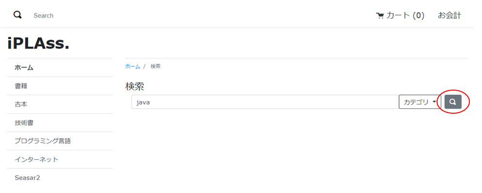
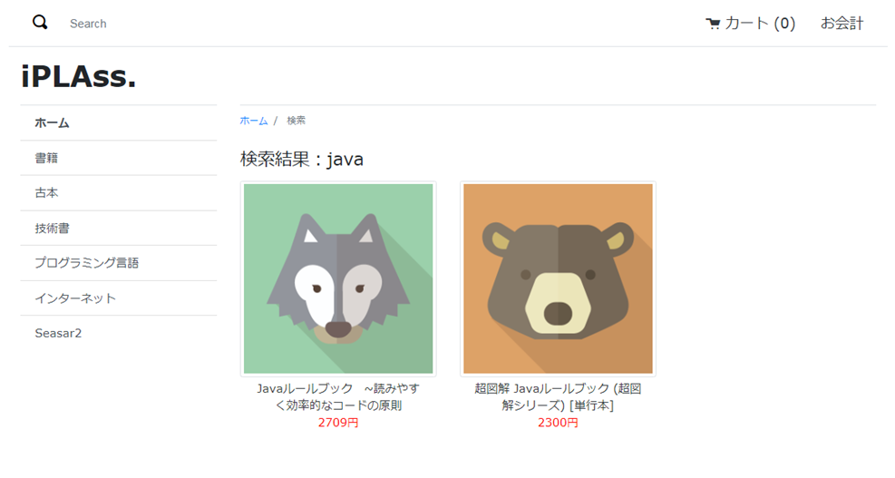

[[Java_Jsp_Webapi]]
=== WebApiとの連携

Ajaxを利用することで、WebApiで連携することができます。一般消費者向けのECサイト画面における全文検索処理を例として説明していきます。

* 開発者ガイドの<<../../developerguide/webapi/index#,WebApiの作成方法>>を参照してください。 +
以下はここで利用しているWebApiです。
+
[cols="1,2"]
|===
h|WebApi名|samples/ec01/search/fulltextSearch
|===

* WebApiを利用しているJSPテンプレート
+
[cols="1,2"]
|===
h|ファイル名|/src/main/webapp/jsp/samples/ec01/search/search.jsp
|===
+
[source,jsp]
----
----------------------------------------JSP部分略----------------------------------------

----
<1> WebApiによる検索処理を呼び出します。
<2> 検索処理でエラーが発生した場合、クライアント側での処理。
<3> 返された検索処理の結果を取得し、クライアント側の描画処理を呼び出します。
<4> 検索結果の描画処理。

[[Java_JSP_WebAPI_Operation_Check]]
* 動作確認
** キーワードを入力し、検索ボタンをクリックします。
+

** 返却値の例
+
[source,json]
----
{"status":"SUCCESS","defaultResult":[{"definitionName":"samples.ec01.products.Product","price":2709,"name":"Javaルールブック　~読みやすく効率的なコードの原則","productImg":{"lobId":195,"name":"wolf.png","type":"image/png","definitionName":"samples.ec01.products.Product","propertyName":"productImg","oid":"EC011","size":13872},"oid":"EC011"},{"definitionName":"samples.ec01.products.Product","price":2300,"name":"超図解 Javaルールブック (超図解シリーズ) [単行本]","productImg":{"lobId":208,"name":"bear.png","type":"image/png","definitionName":"samples.ec01.products.Product","propertyName":"productImg","oid":"EC019","size":12051},"oid":"EC019"}]}
----

** 検索結果を画面から確認できます。
+

