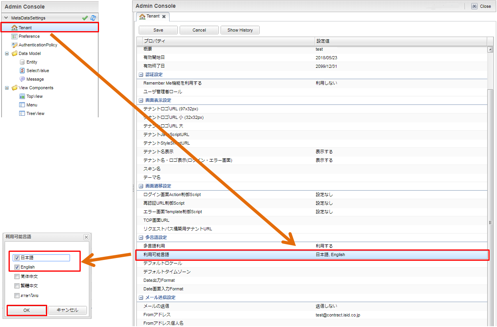
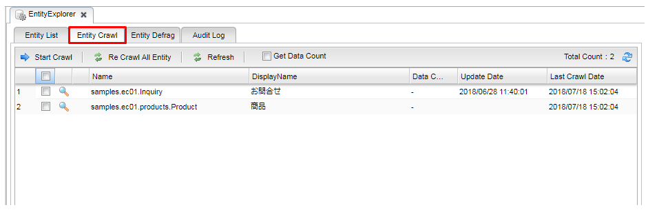

[[Java_JSP_Setup]]
== セットアップ
サンプルアプリケーションのセットアップに関する説明です。 +
もし、既にiPLAssの<<../../gettingstarted/installguide/index#,開発環境の構築>>と<<../../gettingstarted/index#_チュートリアル,チュートリアル>>を実行できており、サンプルアプリケーションを動かしたい場合、以下の手順に従って実施してください。 +
それ以外の場合は、<<../../gettingstarted/installguide/index#,開発環境の構築>>を先に実施することをお勧めします。

* サンプルアプリケーションのプロジェクトをlink:https://github.com/dentsusoken/iplass-sample-app[GitHub]から取得してプロジェクトを作成します。プロジェクトの作成手順は<<../../gettingstarted/installguide/index#_プロジェクトの作成,プロジェクトの作成>>を参照してください。
+
[TIP]
====
サンプルコードで Java21 より上のバージョンのスタイルでコーディングする場合は build.gradle の javaVersion を使用したい Java のバージョンに書き換えてください。 +
書き換えた後はGradleプロジェクトのリフレッシュを行い、エラーが出ないことを確認してください。

.build.gradle
[source,groovy]
-----
apply plugin: 'java'
apply plugin: 'war'
apply plugin: 'eclipse-wtp'

ext {
	javaVersion = JavaVersion.VERSION_21 <1>
}

----------------------------------------以下略----------------------------------------
-----
<1> 必要に応じて使用したい Java のバージョンに書き換えます。
====

[[Java_JSP_Setup_runTenantBatch]]
* テナントの作成
+
[NOTE]
このサンプルアプリは<<../../gettingstarted/installguide/index#,開発環境の構築>>の章で作成したテナントで動かすことを想定しています。もし新規テナントで
サンプルアプリを起動したい場合、以下の手順を実施してください。
+
** mtp-service-config.xmlに以下の設定を入れます。
+
[source,xml]
-----
	<!-- Rdb Connection Settings -->
	<service>
		<interface>org.iplass.mtp.impl.rdb.connection.ConnectionFactory</interface>

		<!-- DataSource base ConnectionFactory -->
        <!-- <class>org.iplass.mtp.impl.rdb.connection.DataSourceConnectionFactory</class> --> <1>
        <!-- <property name="dataSourceName" value="java:comp/env/jdbc/iplass" /> --> <1>

		<!-- DriverManager base ConnectionFactory -->
		<class>org.iplass.mtp.impl.rdb.connection.DriverManagerConnectionFactory</class> <2>
		<!-- for mysql -->
		<property name="url" value="jdbc:mysql://[host]:[port]/[schema]" />
		<property name="user" value="XXXXX" /> <3>
		<property name="password" value="XXXXX" /> <3>
		<property name="driver" value="com.mysql.cj.jdbc.Driver" /> <4>

		<!-- if sql execution exceeds this milliseconds, log sql by warn level.(0 means no log by warn level) -->
		<property name="warnLogThreshold" value="0" />

		<!-- If change transaction isolation level on create connection, set below. -->
		<!--
		<property name="transactionIsolationLevel" value="READ_COMMITTED" />
		 -->

	</service>
-----
<1> データソース利用に関する設定項目をコメントアウトします。
<2> DriverManager利用に関する設定項目を追加します。
<3> テナント作成時はDBA権限を持つユーザーを設定してください。
<4> クラスパスが通っている場所にJDBCドライバを配置します。

** サンプルアプリのルートパスの下で 、
+
. Gradleタスクの `runTenantBatch` を実行します。
. 起動した画面で `Create Default Tenant` をクリックします。
. ダイアログで `name（テナント名）` 、 `AdminUserId（管理者ユーザーID）` 、 `AdminUserPassword（管理者ユーザーパスワード）` を入力し、 `Create` をクリックします。

[IMPORTANT]
サンプルアプリでは、データベースへの接続方法にDataSourceを利用することを想定していますが、テナントを作成する処理の `runTenantBatch` タスクではDataSourceに関する設定を利用できないため、一時的に接続方法をDataSource利用からDriverManager利用に変えます。テナント作成後は、再度DataSourceを利用する設定に戻してください。

* 以下のサンプルアプリの起動手順を順に実施してください。

[[Java_JSP_Setup_startup]]
.サンプルアプリの起動手順

. サンプルアプリでは、DataSourceを利用するため、mtp-service-config.xmlでDataSource名を設定します。また、Tomcatのコンテキスト設定にDataSourceの接続情報を入れます。 +
また、Tomcatの `lib` フォルダに利用するDBに該当するJDBCドライバを入れます。
+
[cols="1,2"]
|===
h|ファイル名|/src/main/resources/mtp-service-config.xml
|===
+
[source,xml]
----
<!-- Rdb Connection Settings -->
<service>
    <interface>org.iplass.mtp.impl.rdb.connection.ConnectionFactory</interface>

    <!-- DataSource base ConnectionFactory -->
    <class>org.iplass.mtp.impl.rdb.connection.DataSourceConnectionFactory</class>
    <property name="dataSourceName" value="java:comp/env/jdbc/iplass" />　<1>

    <!-- if sql execution exceeds this milliseconds, log sql by warn level.(0 means no log by warn level) -->
    <property name="warnLogThreshold" value="0" />

    <!-- If change transaction isolation level on create connection, set below. -->
    <!--
    <property name="transactionIsolationLevel" value="READ_COMMITTED" />
    -->

</service>
----
<1> サンプルアプリ実行用のDataSource名
+
<<../../gettingstarted/installguide/index#,開発環境の構築>>の章で作成したデータベースの接続情報をインストールしたTomcatの次の設定ファイルに入れます。
+
[source]
----
%CATALINA_HOME%\conf\context.xml
----
+
[source,xml]
----
<?xml version="1.0" encoding="UTF-8"?>

    <WatchedResource>WEB-INF/web.xml</WatchedResource>
    <WatchedResource>${catalina.base}/conf/web.xml</WatchedResource>

     <Resource name="jdbc/iplass" auth="Container" type="javax.sql.DataSource"
            maxTotal="100" maxIdle="30" maxWaitMillis="10000"
            username="XXXXX" password="XXXXX" driverClassName="com.mysql.cj.jdbc.Driver"
            url="jdbc:mysql://[host]:[port]/[schema]"/> <1>
                
</Context>
----
<1> Tomcatのコンテキスト設定に該当するデータベースの接続情報を入れます。

. サンプルアプリでは、全文検索機能（lucene）を利用するため、mtp-service-config.xmlに記載のあるINDEXファイルの保存場所をローカル環境の適当な場所に変えます。
+
[cols="1,2"]
|===
h|ファイル名|/src/main/resources/mtp-service-config.xml
|===
+
[source,xml]
----
<service>
    <interface>org.iplass.mtp.impl.fulltextsearch.FulltextSearchService</interface>
    <property name="useFulltextSearch" value="true" /> <1>
    <property name="maxRows" value="1000" />
    <property name="throwExceptionWhenOverLimit" value="true"/>

    <!-- lucene利用 -->
    <class>org.iplass.mtp.impl.fulltextsearch.lucene.LuceneFulltextSearchService</class>
    <property name="directory" value="[set your lucene index file store path. eg: D:\tmp\lucene]" /> <2>
    <property name="analyzer" value="org.apache.lucene.analysis.ja.JapaneseAnalyzer" />
    <property name="indexWriterRAMBufferSizeMB" value="64.0"/>
    <property name="redundantTimeMinutes" value="10"/>
</service>
----
<1> useFulltextSearchをtrueに設定します。
<2> INDEXファイル保存場所をローカルパスの適当な場所に設定します。

. Tomcatを起動し、`http://localhost:8080/コンテキスト名/テナント名/gem/` にアクセスすると、ログイン画面が表示されます。管理者ユーザーIDとパスワードでログインします。

. Admin Consoleの `Packaging` 機能を利用して、プロジェクトの `sample-data` フォルダにあるサンプル実行用のデータをインポートします。
+
「entitydata.zip」ファイルを、Admin Consoleの「Packaging」ツールで取り込んでください。
+
image::images/sample-ec_java-jsp-setup-package-upload.png[align=left]
+
デフォルトの設定で「Import」ボタンを押下してください。
+

+
Importを実行すると「Log」パネルに処理状況が表示されます。処理が終了したタイミングでエラーが発生していないことを確認してください。
+

+
新たに作成したロールなどを反映させるために、MetaDataSettingsメニューの右上の「MetaDataのリフレッシュ」アイコンをクリックします。
+

. Admin Consoleのテナント情報の多言語利用設定で、「日本語」と「English」にチェックを入れます。
+

+
「Save」ボタンを押してください。
+
image::images/sample-ec_java-jsp-setup-tenant-multilingual-save.png[align=left]

. Admin ConsoleでEntityExplorerの `Entity Crawl` 機能を利用して全文検索のINDEXデータを作成します。 +
詳細については、<<../../developerguide/datamanagement/index#fulltextsearch_view,全文検索>>を参照してください。
+
ToolsのEntityExplorerを選択します。
+
image::images/sample-ec_java-jsp-setup-entityexplorer.png[align=left]
+
全文検索を利用する設定になっている場合、「Entity Crawl」タブが表示されます。
+

+
A) 任意のEntityのみを対象としてクローリングしたい場合は、リストの対象Entityにチェックを入れて、「Start Crawl」ボタンをクリックしてください。
+
B) クローリング対象Entityをすべてクローリングしたい場合は「Re Crawl All Entity」ボタンをクリックしてください。
+
C) クローリングが完了したら、最新のINDEXデータを反映させるために、「Refresh」ボタンをクリックしてください。
+
image::images/sample-ec_java-jsp-setup-entityexplorer-crawl.png[align=left]

. 上記起動手順の実施が完了しましたら、<<../index#GlobalSettings,サンプルアプリのグローバル設定>>を確認してください。