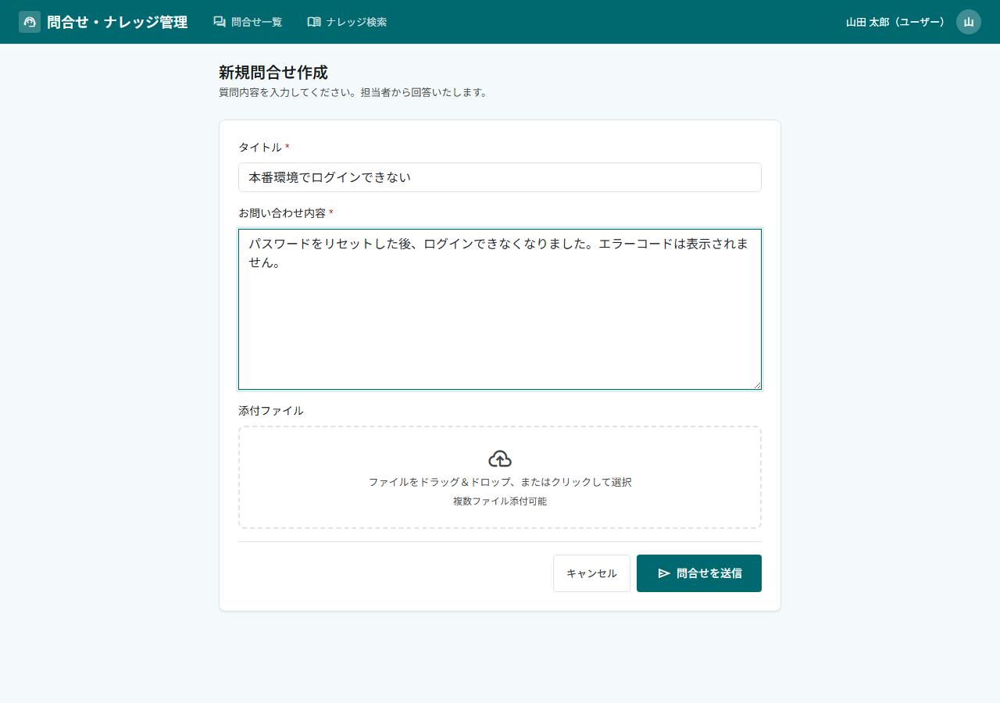
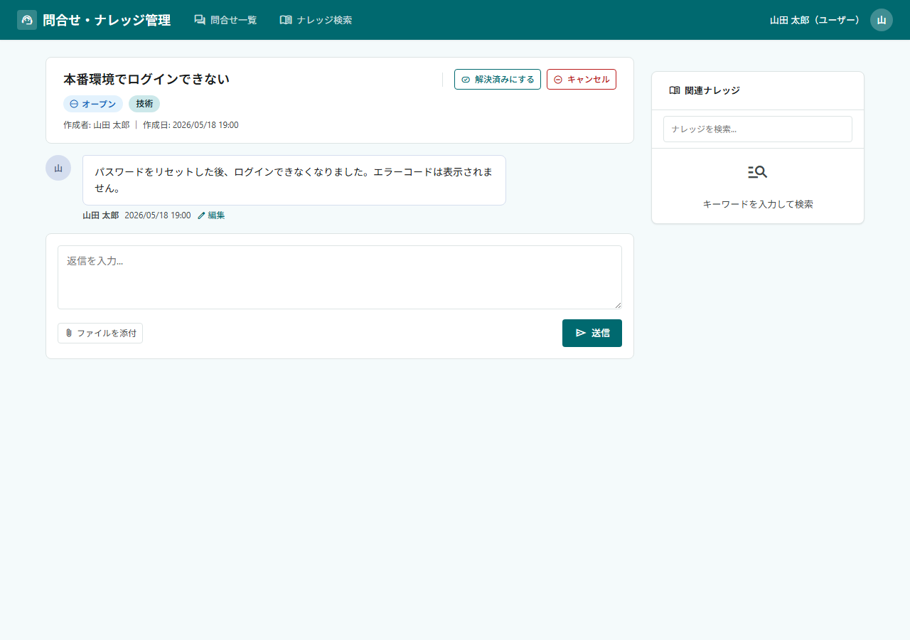
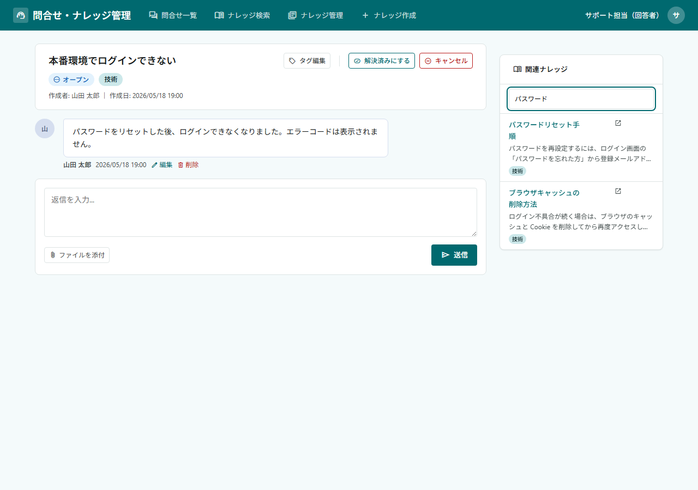
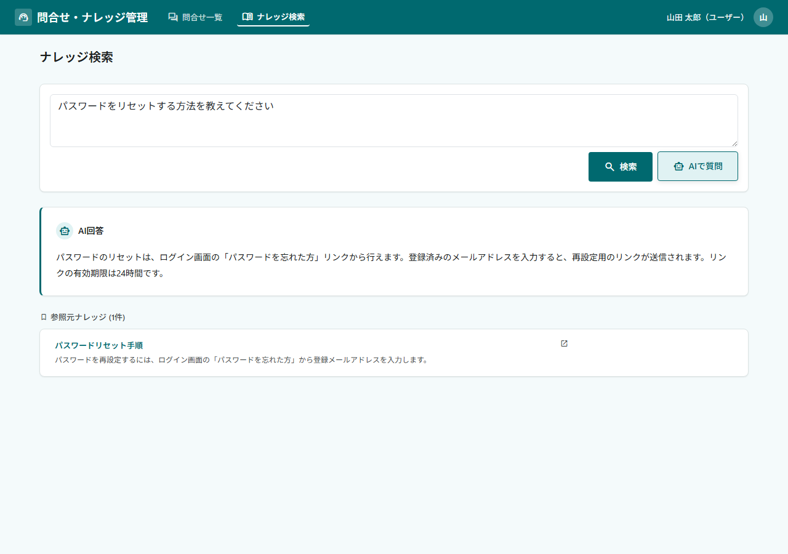
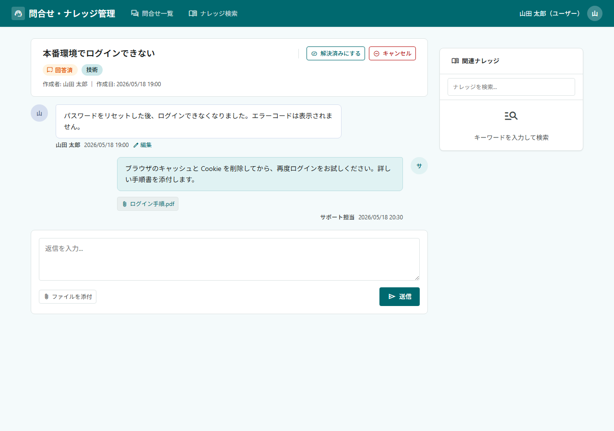
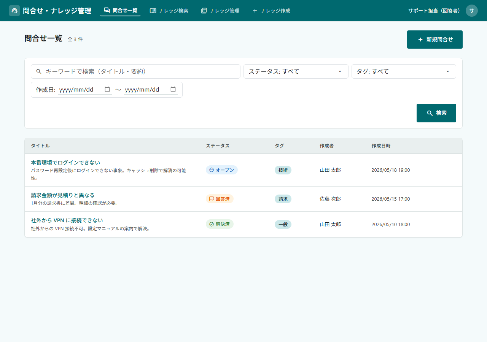
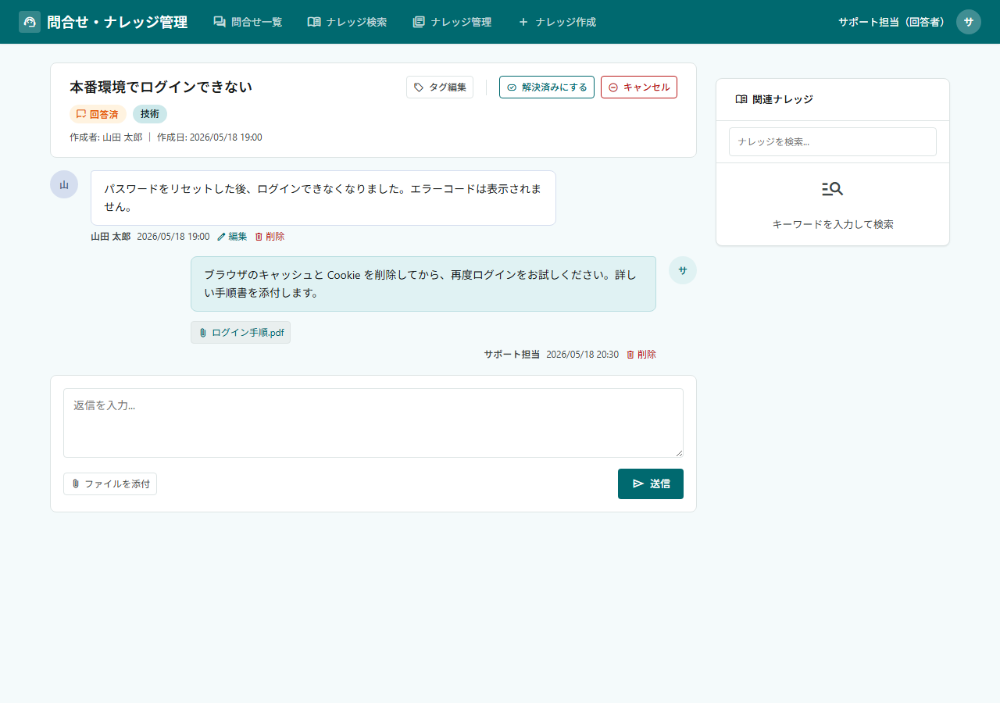
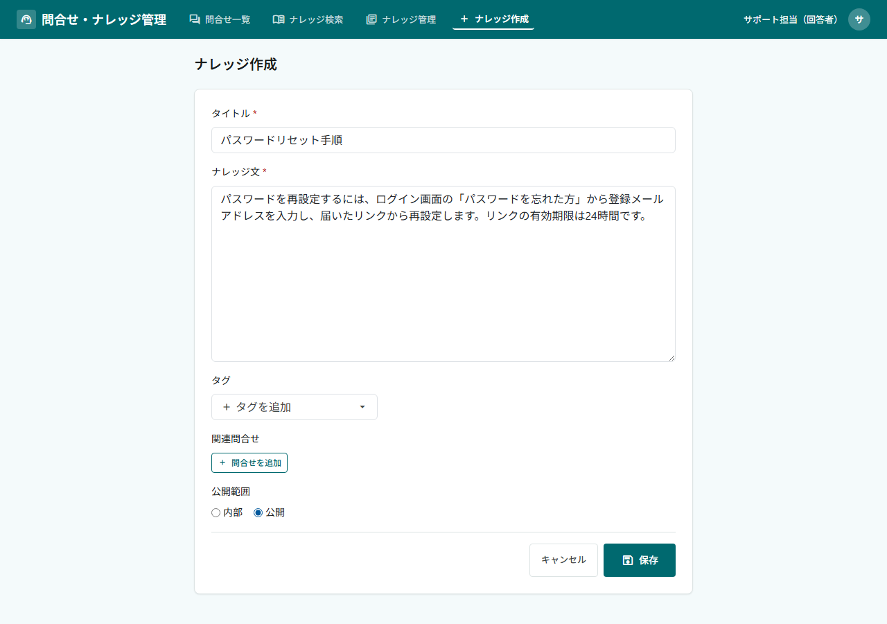
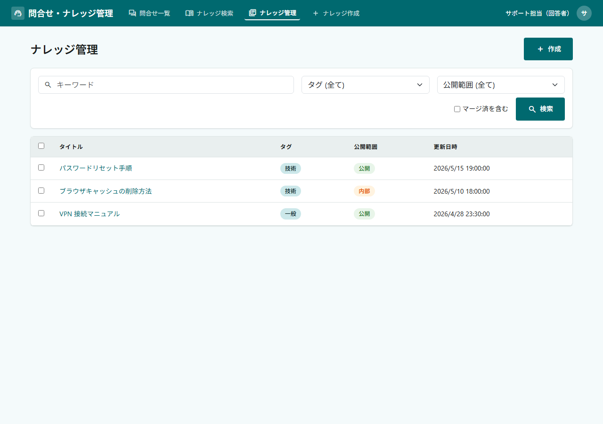
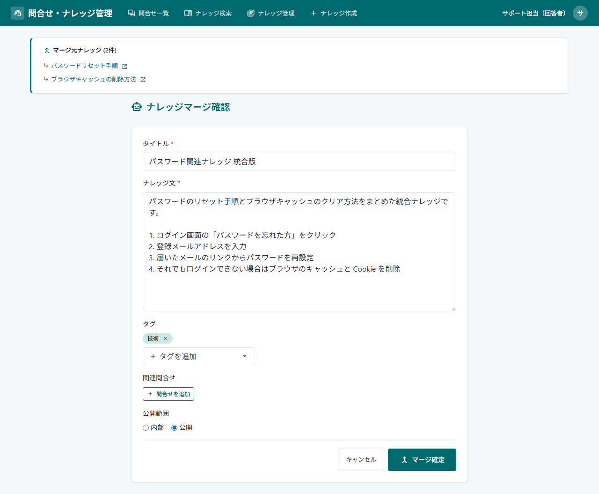

[[Knowledge_Management_BusinessFlow]]
== 業務フロー
問合せの起票からクローズ、解決した問合せをもとにしたナレッジの作成・公開までの流れを、画面操作に沿って説明します。 +
ロールによって表示・操作できる内容が変わるため、質問者と回答者に分けて説明します。

[NOTE]
以下のうち AI を利用する操作は Enterprise Edition の機能です。該当する操作には「EE only」を付しています。

=== 質問者の操作

==== 問合せの起票
* ナビゲーションの「新規問合せ」を開き、件名と最初の質問を入力します。ファイルを添付することもできます。 +
「送信」をクリックすると問合せが起票され、チャット形式の問合せ画面に遷移します。
+

+

===== 関連ナレッジの検索
* 問合せ画面の右側のパネルで、質問に関連するナレッジをキーワードで検索できます。
+

* Enterprise Editionでは、このパネルが [.eeonly]#AI による類似ナレッジ提案# に置き換わり、問合せ内容から関連ナレッジを自動で提案します。詳細は<<./eepackage/index#EEPackage_KM_Rag, RAG 検索・類似ナレッジ提案>>を参照してください。

* [.eeonly]#ナレッジ検索（RAG）#: ナビゲーションの「ナレッジ検索」では、自由文で質問を入力すると、AI がナレッジを検索して回答文を生成し、参照元のナレッジとともに表示します。質問者は外部公開ナレッジのみが検索対象です。
+

==== 回答の確認とクローズ
* 回答者から回答が投稿されると、問合せは「回答済」ステータスに変わります。 +
質問者は追加で質問を投稿するか、解決した場合は「解決済み」、解決しなかった場合は「キャンセル」で問合せをクローズします。
+

* クローズ後も、質問者は問合せを再オープンして再質問できます。

=== 回答者の操作

==== 問合せの検索と回答
* ナビゲーションの「問合せ一覧」で、問合せをステータス・タグ・全文検索で検索します。
* [.eeonly]#問合せの要約生成#: 一覧の各行には AI が生成した問合せの要約が表示されます。詳細については<<./eepackage/index#EEPackage_KM_Inquiry, 問合せの AI 機能>>を参照してください。
+

* 問合せ画面を開いて回答を投稿します。
* [.eeonly]#タグの自動付与#: 問合せの会話内容に基づき、問合せにタグが自動設定されます。
+

==== ナレッジの作成
* 解決した問合せをもとにナレッジを作成します。 +
ナレッジ追加・編集画面で、ナレッジ文・タグ・関連問合せ・公開範囲（内部／外部）を入力して登録します。
* [.eeonly]#ナレッジのドラフト生成#: 問合せ内容から AI がナレッジのドラフトを生成します。詳細は<<./eepackage/index#EEPackage_KM_Knowledge, ナレッジの AI 機能>>を参照してください。
+

==== ナレッジの検索・編集・マージ
* ナレッジ管理画面で、登録済みのナレッジを検索・編集・削除します。
+

* 内容が重複する複数のナレッジを選択し、1つにマージできます。
* [.eeonly]#ナレッジのマージ#: 選択されたナレッジから、AI がマージ結果のドラフトを生成します。詳細は<<./eepackage/index#EEPackage_KM_Knowledge, ナレッジの AI 機能>>を参照してください。
+

