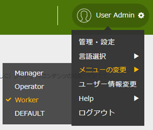
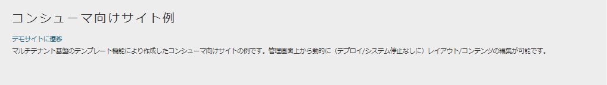
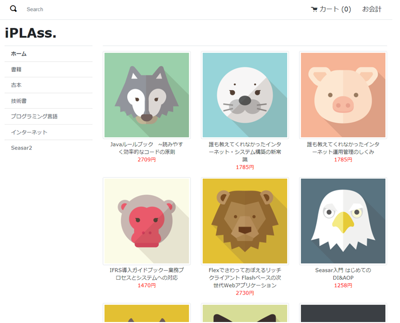

[[application_overview]]
== サンプルアプリケーションについて
BookStoreを題材にしたサンプルアプリケーションです。 +
各テナントにサンプル用のメタデータとEntityデータを取り込むことで動作します。

== アプリケーション全体像

.サンプルは二つの機能構成になっています。

* 運営者向け + 
商品や注文などの情報を管理する機能です。 + 
Gemベースの画面を利用して実装されています。

* 一般消費者向け（ECサイト） + 
商品購入するための機能です。 + 
実装は三つのパターンになっています。Jsp、GroovyTemplateとVue.jsを利用して独自で実装されています。

=== 運営者向け画面
* ログイン画面にテナント作成時に登録された管理者IDとパスワードを入れてログインします。

* メニュー変更リストを確認する。このサンプルでは `Manager`（マネージャー）、`Operator`（オペレーター）、`Worker`（利用ユーザー）三つのロールに対するメニュー画面トップメニュー画面が用意されていることを確認します。
+

* マネージャーグループに属する管理者向けのTop画面
+
image::images/sample-ec_mantainance-top-page.png[align=left]

=== 一般消費者向け（ECサイト）画面

* 管理者向けのTop画面に下のリンクが表示されています。クリックすると、一般消費者向け（ECサイト）のTop画面に遷移することができます。
+

* 一般消費者向けのTop画面
+
