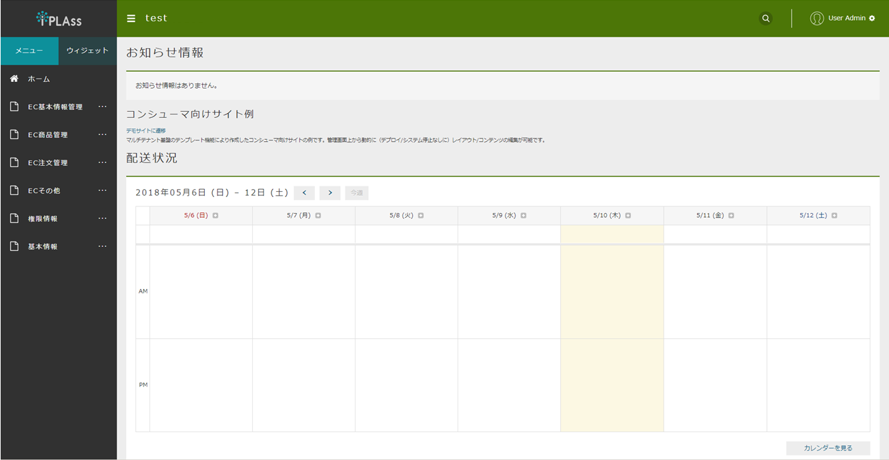

[[application_overview]]
== サンプルアプリケーションについて
オンライン書店を題材にしたサンプルアプリケーションです。 +
テナントにサンプルアプリ用のメタデータとEntityデータを取り込むことで動作します。

== アプリケーション全体像

.サンプルアプリは2つの機能で構成されています。

* 運営者向け（管理画面） +
運営者が、オンライン書店の商品や注文、問い合わせ、配送状況などの情報を管理するための機能です。 +
iPLAssが標準提供するGEMモジュールの汎用データ操作画面を利用して実装されています。

* 一般消費者向け（ECサイト） +
一般消費者が、オンライン書店の商品を閲覧したり、購入したりするためのECサイト機能です。 +
実装は3つのパターンを用意しています。Java/JSP、Groovy/GroovyTemplate、Vue.js/WebAPIを利用して独自カスタマイズで実装されています。

=== 運営者向け（管理）画面
* ログイン画面にテナント作成時に登録した管理者IDとパスワードを入力してログインします。
* メニューの変更リストを確認します。このサンプルアプリでは、 `Manager（マネージャー）`、 `Operator（オペレーター）`、`Worker（利用ユーザー）` という3つのロールに対応する管理画面がそれぞれ用意されています。
+
image::images/sample-ec_mantainance-top-page-menu.png[align=left]

* Manager（マネージャー）に属する運営者向けのTop画面
+

=== 一般消費者向け（ECサイト）画面
* 運営者向け（管理画面）のTop画面にリンクが表示されています。クリックすると、一般消費者向け（ECサイト）のTop画面に遷移することができます。
+

* 一般消費者向け（ECサイト）のTop画面
+
