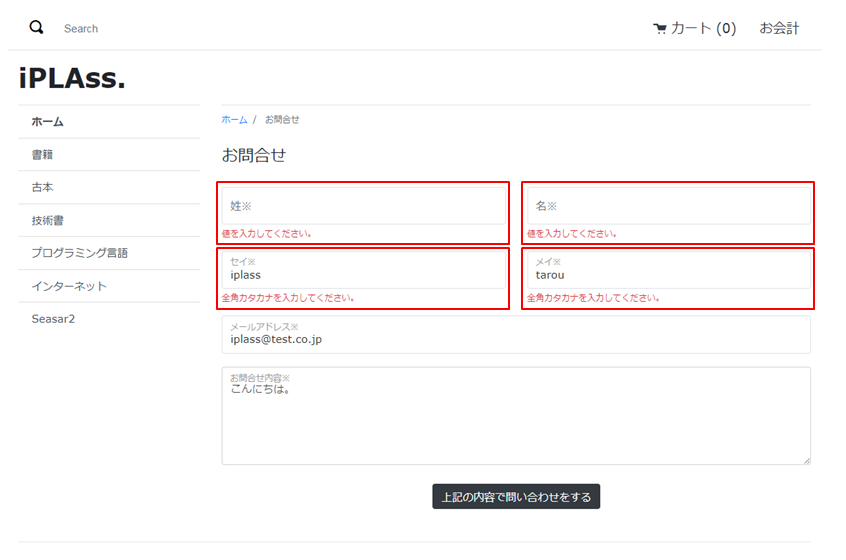
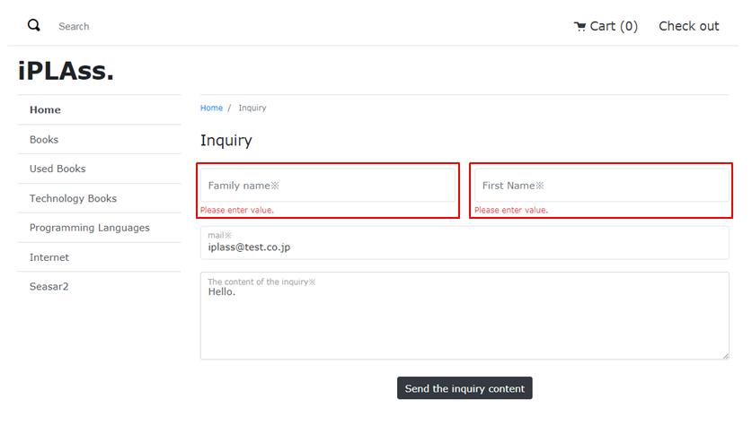

[[VueJS_WebAPI_BeanValidation]]
=== Bean／Bean Validation
iPLAssのBean／Bean Validation機能を利用する場合、チェックしたいBeanクラスのプロパティにアノテーションをつけることで、バリデーションが自動に実行されます。それに、バリデーション結果を画面に表示できます。

サンプルアプリのお問い合わせ登録画面で入力された値に対してバリデーションが実行される機能を例として説明していきます。 

* 必要なJavaクラスを作成しています。 + 
プロジェクトのフォルダ src/main/java/samples/ec01/beanを開きます。
+
[source]
----
src.main.java
	┗ samples.ec01
		┣ bean
		┗ annotation <1>	
			┃	┣ Kana.java
			┃	┗ ......		　
			┣ ui		
			┣ validator	<2>
			┃	┣ group	<3>
			┃	┃	┗ JapaneseChecks.java	
			┃	┣ KanaValidator.java 
			┃	┗ ......
			┣━ UserBean.java <4>
			┗ ......
----
<1> カスタムのバリデーション + 
カスタムのバリデーションを `samples.ec01.bean.annotation.Kana` に記述して、それがカスタムのバリデーターを利用しています。
<2> カスタムのバリデーター + 
カスタムのバリデーターを `samples.ec01.bean.validator.KanaValidator` に記述して、それがカスタムのバリデーションで利用されています。
<3> カスタムのバリデーショングループ + 
カスタムのバリデーショングループを `samples.ec01.bean.validator.group.JapaneseChecks` に記述して、それがBeanクラスのアノテーションで利用されています。
<4> JavaBeanクラス +
`samples.ec01.bean.UserBean` でカスタムのバリデーションとバリデーショングループを利用しています。

* バリデーションエラーメッセージを定義する +  
<<index#VueJS_WebAPI_Resources_BeanValidation,Bean Validationエラーメッセージ>>はプロパティファイルに定義し、多言語利用が可能です。

* コマンドクラスでBean Validationを利用する
+
[cols="1,2"]
|===
h|ファイル名|/src/main/java/samples/ec01/command/inquiry/RegistInquiryCommand.java
|===
+
[source,java]
----
......
@WebApi(
		name = "samples/ec01/inquiry/doInquiry", 
		displayName = "お問合せ登録WebApi", 
		accepts = RequestType.REST_JSON, 
		restJson = @RestJson(parameterName = "param"),
		methods = MethodType.POST, 
		privileged = true, 
		tokenCheck = @WebApiTokenCheck(
				executeCheck = true, 
				consume = true, 
				exceptionRollback = true), 
		results = { RegistInquiryCommand.RESULT_MAPPING_RESULT })
@CommandClass(
		name = "samples/ec01/inquiry/RegistInquiryCommand", 
		displayName = "お問合せ登録コマンド")
public class RegistInquiryCommand implements Command {

	private final BeanParamMapper mapper = new BeanParamMapper().withValidation()
			.whitelistPropertyNameRegex("^(mail|content|familyName(Kana)?|firstName(Kana)?)$"); <1>
	public static final String RESULT_INQUIRY_BEAN = "inquiryBean";
	public static final String RESULT_MAPPING_RESULT = "result";

	@Override
	public String execute(RequestContext request) {
		// 入力チェック
		InquiryBean inquiryBean = new InquiryBean();
		request.setAttribute(RESULT_INQUIRY_BEAN, inquiryBean);
		try {
			// 日本語専用"name_kana"取得フォーム
			if (Consts.LANGUAGE_JA.equals(TemplateUtil.getLanguage()) || TemplateUtil.getLanguage() == null) {
				mapper.populate(inquiryBean, request.getParamMap(), Default.class, JapaneseChecks.class); <2>
			} else {
				mapper.populate(inquiryBean, request.getParamMap(), Default.class); <3>
			}
		} catch (MappingException e) {
			request.setAttribute(RESULT_MAPPING_RESULT, e.getResult()); <4>
			return Constants.CMD_EXEC_ERROR;
		}

		Inquiry inquiry = inquiryBean.toEntity();
		// 問い合わせステータス
		// 1 : 未対応
		// 2 : 対応中
		// 3 : 対応完了
		// 4 : 終了
		SelectValue inquiryStatus = new SelectValue(InquiryStatus.NOT_DEAL.getValue());
		inquiry.setInquiryStatus(inquiryStatus);
		// 請求の登録
		EntityDaoHelper.insert(inquiry);

		return Constants.CMD_EXEC_SUCCESS;
	}
}
----
<1> Beanクラスに画面からの入力値をマッピングするためのユーティリティクラスを初期化します。 + 
※ whitelistPropertyNameRegexメソッドにセット可能な項目名の正規表現式を指定します。
<2> 多言語利用で「日本語」が選択されているまたは多言語利用の設定が取得できなかった場合、`samples.ec01.bean.validator.group.JapaneseChecks` グループとデフォルトグループに属する項目に対してバリデーションが実行されます。 + 
※ populate(Object, Map, Class)メソッドはスレッドセーフですが、それ以外の delimiters(char, char, char)等の設定用メソッドがスレッドセーフではありません。 詳しい説明は `org.iplass.mtp.command.beanmapper.BeanParamMapper` のJavaDocを参照してください。
<3> 多言語利用で「日本語」以外が選択されている場合、デフォルトグループに属する項目のみに対してバリデーションが実行されます。
<4> MappingExceptionが発生した場合、それをRequestスコープにセットします。iPLAssが自動にJSON形式に変換してクライアントに返却してくれます。
+
このサンプルでJSON形式に変換されたMappingExceptionの例です。それがVue.js側で解析できるようになっています。
+
[source,JSON]
----
{"status":"ERROR","result":{"errors":[{"propertyPath":"mail","errorMessages":["値を入力してください。"]},{"propertyPath":"familyNameKana","errorMessages":["値を入力してください。"]},{"propertyPath":"firstNameKana","errorMessages":["値を入力してください。"]},{"propertyPath":"content","errorMessages":["値を入力してください。"]},{"propertyPath":"familyName","errorMessages":["値を入力してください。"]},{"propertyPath":"firstName","errorMessages":["値を入力してください。"]}]}}
----

* Vue.jsの部分
+
[cols="1,2"]
|===
h|ファイル名|/src/main/vue/components/inquiry/RegistInquiry.vue
|===
+
[source,html]
----
----------------------------------------以上略----------------------------------------
    <form class="custom-form mt-3">	
        

        ......
            

                

                    <label for="familyNameKana" class="col-form-label label-hidden">{{$t("samples.ec01.inquiry.regist.familyNameKana")}}</label>
                    <input type="text" class="form-control border rounded input-hint-visible" name="familyNameKana" v-model="inquiryBean.familyNameKana" v-bind:placeholder="$t('samples.ec01.inquiry.regist.familyNameKana')">
                    <small class="form-text text-danger"><template v-for="message in errorsMap.familyNameKana">{{message}} </template></small> <1>
                

            

        ......
    </form>
----------------------------------------以下略----------------------------------------
----
<1> 返却されたバリデーションエラーメッセージを画面に出力します。

* 動作確認
** 「姓」と「名」を空文字として登録しようとしたら、バリデーションエラーが発生することを画面から確認できます。
** 「セイ」と「メイ」に全角カタカナ以外の値を入れて登録しようとしたら、バリデーションエラーが発生することを画面から確認できます。
+

** 多言語利用で「英語」が選択された場合、英語のバリデーションエラーメッセージが表示されることを確認できます。
+

+
※ 英語用の画面にカタカナの「セイ」と「メイ」の入力項目がないので、日本語用の画面と比べてレイアウトに少し違いがあります。
