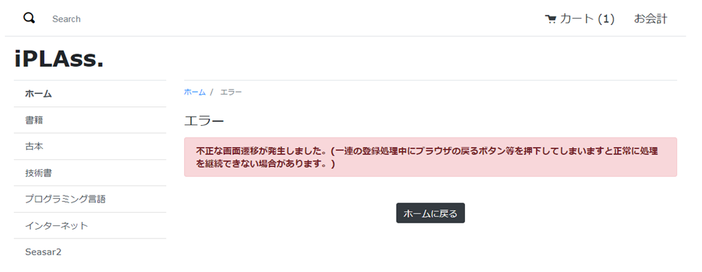

[[VueJS_WebAPI_ErrorHandler]]
=== 共通エラーハンドラー
Vue.js／WebApi版のサンプルでは画面遷移がクライアント側で行っているので、Java／JSP版とGroovy／GroovyTemplate版のサンプルで利用されているErrorUrlSelector機能が使えませんので、`axios` ライブラリのinterceptors機能を利用して似たような機能を実装しています。

[cols="1,2"]
|===
h|ファイル名|/src/main/vue/main.js
|===
[source,Javascript]
----
// Axiosの設定
Vue.prototype.$http = axios.create({
    headers: {'X-Requested-With': 'XMLHttpRequest'}　<1>
});
----------------------------------------以上略----------------------------------------
const app = new Vue({
  el: '#app',
  i18n: i18n,
  router: router,
  methods: {
    setupAxiosErrorInterceptors: function() { <2>
      this.$http.interceptors.response.use((response) => {
        return response;
      }, (error) => {
        console.log(error);
        var errorResult = error.response.data;
        if (errorResult.exceptionType != null) {
          var exception = errorResult.exceptionType;
          this.$router.push({name: 'genericError', params: {'exception': exception}}); <3>
        }
        return Promise.reject(error);
      })
    }
  },
  created: function() {
    // axiosにインターセプターを設定
    this.setupAxiosErrorInterceptors();
  }
});
----------------------------------------以下略----------------------------------------
----
<1> JSONハイジャックによる攻撃を防ぎます。<<VueJS_WebAPI_Security,セキュリティ対策>>を参照してください。
<2> Vue.js側で `axios` にerror interceptorを登録します。
<3> WebApi側でエラーが発生した場合、表示画面がVue.js側で `genericError` という名前で登録されたVueコンポーネントに切り替えられます。
+
※ `axios` と `vue-router` ライブラリの使い方について、公式サイトを参照してください。

.動作確認
TokenValidationExceptionが発生した場合、カスタムのテンプレートに遷移すること。

* Consoleに出力されたエラーログ。
+
[source]
----
14:26:53.626 [http-nio-8080-exec-6] DEBUG 25 873   o.i.mtp.impl.auth.AuthContextHolder - check WebApiPermission [webApiName=samples/ec01/inquiry/doInquiry, parameter=org.iplass.mtp.webapi.permission.RequestContextWebApiParameter@1b1910ae] = true (privilegedExecution)
14:26:53.626 [http-nio-8080-exec-6] DEBUG 25 873 samples/ec01/inquiry/RegistInquiryCommand  o.i.m.i.transaction.LocalTransaction - create new Transaction:org.iplass.mtp.impl.transaction.LocalTransaction@791691ea with readOnly=false, stacked:null
14:26:53.626 [http-nio-8080-exec-6] DEBUG 25 873 samples/ec01/inquiry/RegistInquiryCommand  o.iplass.mtp.transaction.Transaction - rollback transaction cause org.iplass.mtp.web.actionmapping.TokenValidationException: 不正な画面遷移が発生しました(一連の登録処理中にブラウザの戻るボタン等を押下してしまいますと正常に処理を継続できない場合があります)。:org.iplass.mtp.impl.transaction.LocalTransaction@791691ea
org.iplass.mtp.web.actionmapping.TokenValidationException: 不正な画面遷移が発生しました(一連の登録処理中にブラウザの戻るボタン等を押下してしまいますと正常に処理を継続できない場合があります)。
	at org.iplass.mtp.impl.webapi.interceptors.TokenInterceptor.tokenError(TokenInterceptor.java:96)
	at org.iplass.mtp.impl.webapi.interceptors.TokenInterceptor.intercept(TokenInterceptor.java:76)
	at org.iplass.mtp.impl.command.InvocationImpl.proceedCommand(InvocationImpl.java:115)
	at org.iplass.mtp.impl.command.interceptors.TransactionInterceptor.lambda$intercept$0(TransactionInterceptor.java:34)
	at org.iplass.mtp.transaction.TransactionManager.doTransaction(TransactionManager.java:114)
	at org.iplass.mtp.transaction.Transaction.with(Transaction.java:303)
	at org.iplass.mtp.impl.command.interceptors.TransactionInterceptor.intercept(TransactionInterceptor.java:33)
	at org.iplass.mtp.impl.command.InvocationImpl.proceedCommand(InvocationImpl.java:115)
----------------------------------------以下略----------------------------------------    
----

* クライアントに返却されたレスポンス。
+
[source,JSON]
----
{"status":"FAILURE","exceptionType":"org.iplass.mtp.web.actionmapping.TokenValidationException","exceptionMessage":"不正な画面遷移が発生しました(一連の登録処理中にブラウザの戻るボタン等を押下してしまいますと正常に処理を継続できない場合があります)。"}
----

* エラー内容表示画面
+
