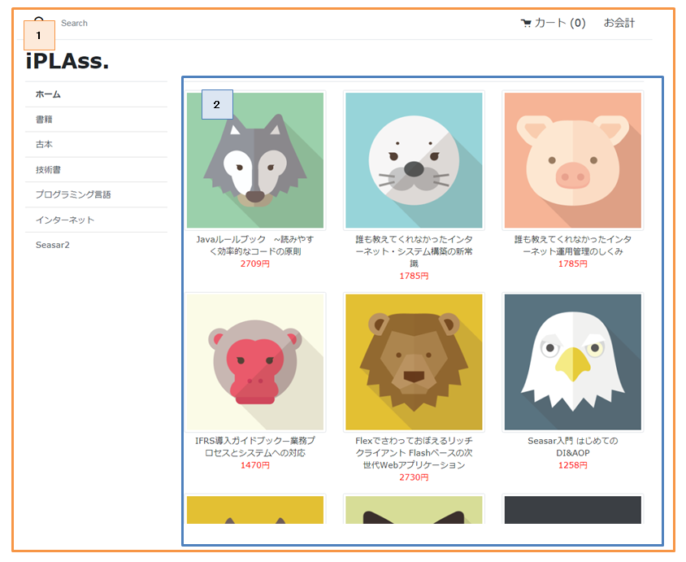

[[VueJS_WebAPI_Layout]]
=== Top画面の作成
* レイアウトの利用 +
Top画面の構成は下図のようになっています。画面共通で利用する2つのレイアウト用Vueコンポーネント `defaultLayout.vue` と `shippingLayout.vue` を用意し、Vue Routerを利用することでアクセスされたパスによって実際のコンテンツを切り替えています。

* Vue.jsの部分
+
[cols="1,2"]
|===
h|ファイル名|/src/main/vue/components/layout/DefaultLayout.vue
|===
+
[source,html]
----
----------------------------------------以上略----------------------------------------
    

      

        

          

            

              <router-link
                :to="{ name: 'top' }"
                class="list-group-item list-group-item-action fw-bold border-top"
              >
                {{ $t('samples.ec01.layout.defaultLayout.home') }}
              </router-link>
              <template v-for="category in categoryList" :key="category.oid">
                <router-link
                  :to="{ name: 'category', query: { categoryId: category.oid } }"
                  class="list-group-item list-group-item-action"
                >
                  {{ category.name }}
                </router-link>
              </template>
            

          

        

      

      <router-view></router-view> <1>
    

----------------------------------------以下略----------------------------------------
----
<1> 実際のコンテンツを表示する箇所を指定するrouter-viewタグです。 +
※ Vue Router部分の説明は割愛します。詳細は、Vue Routerの公式ドキュメントを参照してください。
